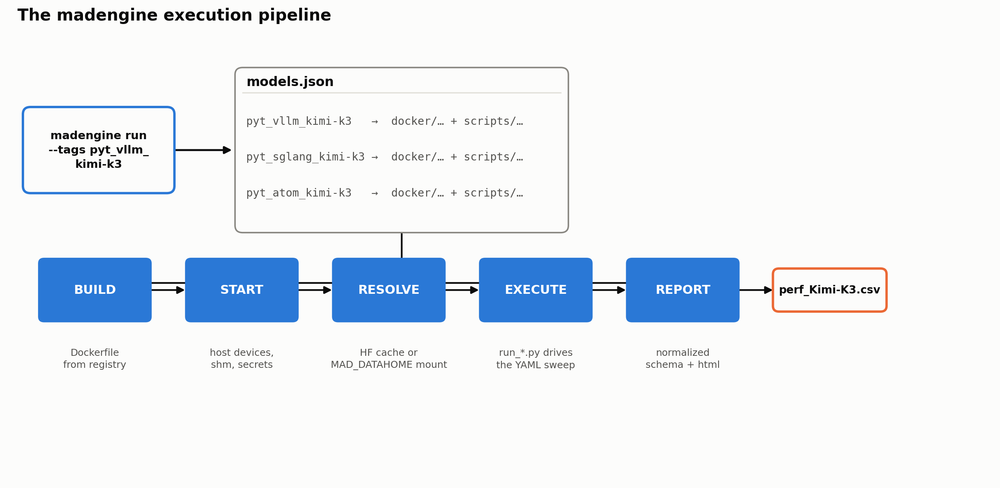
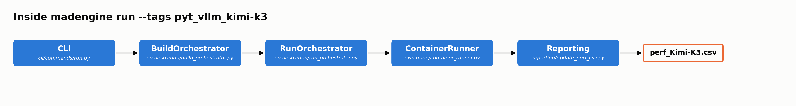

# One Model, Three Engines, One Command: Day-0 Kimi-K3 Benchmarking with MAD

**July 29, 2026 · 12 min read · AMD MAD Team**

`#automation` `#benchmarking` `#reproducibility` `#kimi-k3` `#mi355x`

---

When Moonshot AI released the weights for **Kimi-K3** — a 2.8-trillion-parameter,
1M-context, natively-MXFP4 Mixture-of-Experts model — the AMD ecosystem was ready
on day 0 across **three independent serving frameworks**: vLLM, SGLang, and ATOM.

Most day-0 announcements stop at "it runs." The harder, quieter problem is the one
this post is about: *how do you benchmark a brand-new 1.56 TB model, on three
different engines, on new-silicon (gfx950) kernels, and trust the numbers you get
back?* Three engines mean three container images, three server launchers, three
benchmark clients, three result formats, and three chances to compare apples to
oranges.

MAD's answer is **madengine** — the automation layer that collapses all of that into
a single, declarative, reproducible command. This post is about the *ecosystem*, not
just the model: how MAD turns day-0 enablement into day-0 **measurable, comparable,
repeatable** enablement.

---

## TL;DR

- **One command per engine.** `madengine run --tags pyt_vllm_kimi-k3` (or `pyt_sglang_kimi-k3`,
  `pyt_atom_kimi-k3`) builds the image, launches the server, drives the benchmark, and
  emits a normalized `perf_Kimi-K3.csv` — no manual container plumbing.
- **One shared sweep, three engines.** All three frameworks run the *same* identical
  workload shape — 8192 input / 1024 output, concurrency `1·4·8·16·32·64·128·256`, TP8 —
  so cross-engine numbers are directly comparable by construction.
- **Declarative configs, not shell scripts.** Every server flag, environment variable,
  and sweep axis lives in a versioned YAML. The recipe *is* the config; reproducing a run
  is re-running the file.
- **Hardware-aware guardrails.** `skip_gpu_arch` keeps today's MI350X/MI355X-only
  recipe from silently mis-running on an architecture it hasn't been validated for;
  `arch_overrides` is the same mechanism a future MI300X wideEP recipe would use once
  one is validated.
- **Reliability by design.** Automatic server-health gating, unbuffered logging, model-cache
  reuse, and a fixed CSV schema make a run on your cluster reproduce a run on ours.
- **Real numbers, not a mockup.** An out-of-the-box `madengine run` on 8× MI355X already
  shows all three engines converging mid-sweep and then diverging — see Figure 2.

---

## The Day-0 Benchmarking Problem

Kimi-K3 is not a bigger Kimi-K2. As the vLLM preview notes, it changes the serving
problem along many axes at once — hybrid KDA + full attention, Attention Residuals,
896 routed experts (16 active), MXFP4 weights with the SiTU activation, and native
vision. Each axis lands somewhere different in each engine's stack.

Now multiply that by three frameworks, each with its own conventions:

| Concern | vLLM | SGLang | ATOM |
|---|---|---|---|
| Container image | `vllm/vllm-openai-rocm:kimi-k3` | `lmsysorg/sglang-rocm:...-k3-20260727` | `rocm/atom-dev:...20260727_kimi_k3` |
| Server entrypoint | `vllm serve` | `sglang serve` | `python -m atom.entrypoints.openai_server` |
| MoE selector env | `AITER_SITUV2_A8W4=1` | `AITER_FLYDSL_FORCE=1` + `SGLANG_AITER_K3_OPT=1` | `AITER_FLYDSL_FORCE=1` + `ATOM_USE_TRITON_MOE=0` |
| Attention flag | (engine default) | `--attention-backend triton` | `ATOM_USE_UNIFIED_ATTN=1` |
| Reasoning parser | `--reasoning-parser kimi_k3` | `--reasoning-parser kimi_k3` | (via server) |
| Benchmark client | `vllm bench serve` | `sglang.benchmark.serving` | `atom.benchmarks.benchmark_serving` |
| Result JSON schema | `total_token_throughput`, `median_ttft_ms`… | SGLang JSONL | ATOM `median_*_ms` |

Doing this by hand means three sets of `docker run` incantations, three server
launch sequences, three health-check loops, and three JSON parsers — and then a
fourth, error-prone step of hand-reconciling the outputs into something comparable.
Every one of those steps is a place for a silent divergence: a mismatched input
length, a different concurrency point, a forgotten environment flag that quietly
selects the slow MoE path.

MAD exists to remove all of those steps.

---

## The MAD Automation Flow

MAD is built around a **declarative model registry** (`models.json`) and the
**madengine** runner. A single entry fully describes how to build, run, and score a
workload — and one command executes the whole pipeline.



*Figure 1: The madengine execution pipeline. One registry entry drives all five stages;
the only thing that changes between engines is which row of `models.json` you select.*

> Editable source: [`assets/kimi-k3-madengine-pipeline.drawio`](assets/kimi-k3-madengine-pipeline.drawio)
> — open in [diagrams.net](https://app.diagrams.net) or the draw.io desktop app to modify,
> then re-export as PNG/SVG over the file above.

For every model, madengine performs the same five steps — **Build → Start → Resolve →
Execute → Report** — regardless of which engine sits underneath. That uniformity is the
whole point: the *operator experience* is identical across vLLM, SGLang, and ATOM, even
though the internals could not be more different.

### The registry entry is the contract

Here is the entire specification needed to make Kimi-K3-on-vLLM a first-class,
one-command benchmark:

```json
{
  "name": "pyt_vllm_kimi-k3",
  "dockerfile": "docker/pyt_vllm_kimi_k3",
  "scripts": "scripts/vllm/run.sh",
  "data": "huggingface",
  "n_gpus": "-1",
  "multiple_results": "perf_Kimi-K3.csv",
  "tags": ["pyt", "vllm", "inference"],
  "skip_gpu_arch": "<unsupported-gpu-arch>",
  "args": "--model_repo moonshotai/Kimi-K3 --config configs/default.yaml"
}
```

(`skip_gpu_arch` here is shown as a placeholder rather than a literal ROCm codename —
the field takes whatever architecture string `rocminfo` reports for an unsupported
GPU generation; see the next section for what it resolves to today.)

Three engines, three near-identical entries — differing only in `dockerfile`,
`scripts`, and `config`. The SGLang entry even ships **two variants** (`nospec` and
`dspark` for speculative decoding) from the same script by passing `--variant`, and the
same `perf_Kimi-K3.csv` collects them all.

```json
{ "name": "pyt_sglang_kimi-k3",
  "scripts": "scripts/sglang/run_kimi_k3.sh",
  "args": "--model_repo moonshotai/Kimi-K3 --config configs/kimi_k3.yaml --variant nospec" }

{ "name": "pyt_sglang_kimi-k3_dspark",
  "scripts": "scripts/sglang/run_kimi_k3.sh",
  "args": "--model_repo moonshotai/Kimi-K3 --config configs/kimi_k3.yaml --variant dspark" }
```

### What's actually running under those five stages

Figure 1 is the operator's view. Underneath it, `madengine run --tags pyt_vllm_kimi-k3`
walks through a fixed chain of orchestrator and execution classes — the same chain for
every model in the registry, Kimi-K3 included:



*Figure 3: madengine's internal call chain for a Kimi-K3 run — the same five classes
handle every model in the registry.*

> Editable source: [`assets/kimi-k3-madengine-architecture.drawio`](assets/kimi-k3-madengine-architecture.drawio)
> — open in [diagrams.net](https://app.diagrams.net) or the draw.io desktop app to modify,
> then re-export as PNG/SVG over the file above.

The CLI's `run()` command hands off to `RunOrchestrator.execute()`, which — for the
"build + run" path this post uses — first calls `BuildOrchestrator.execute()` to turn the
registry's `dockerfile` field into an image via `DockerBuilder.build_image()`. Back in
`RunOrchestrator`, `Context.get_system_gpu_architecture()` shells out to `rocminfo` to read
the host's `gfxNNN` string, and that value is exactly what the `skip_gpu_arch` gate
from the previous section is checked against. `ContainerRunner` then takes over: it asks
`Data` (madengine's data-provider abstraction) to resolve `MAD_DATAHOME` for the
`"data": "huggingface"` entry, launches the container, and executes the registry's
`scripts` field inside it — `scripts/vllm/run_vllm.py` for this model. Everything the
container writes out lands back in `perf_Kimi-K3.csv` via `update_perf_csv()`, the same
sink both `Figure 1`'s REPORT stage and Reliability Engineering's "Deterministic,
normalized output" section describe. No part of this chain is Kimi-K3-specific — it is
the same five classes for every one of the hundreds of models in the registry, which is
why adding Kimi-K3 support only meant writing new `models.json` rows, Dockerfiles, and
run scripts, not touching madengine itself.

---

## The Innovation: The Config *is* the Recipe

The most powerful idea in the MAD flow is that **the benchmark recipe lives in
version-controlled YAML, not in a person's terminal history.** Every server flag,
every environment toggle that selects a kernel path, and every sweep axis is
declarative and auditable.

Here is the actual Kimi-K3 config for vLLM (`scripts/vllm/configs/default.yaml`):

```yaml
- benchmark: serving
  model: moonshotai/Kimi-K3
  tp: 8
  inp: 8192
  out: 1024
  dtype: auto
  max_concurrency: 1 4 8 16 32 64 128 256      # the shared K3 sweep
  env:
    VLLM_ROCM_USE_AITER: 1
    SAFETENSORS_FAST_GPU: 1
    AITER_SITUV2_A8W4: 1                        # selects the aiter a8w4 MoE path
    AITER_BF16_FP8_MOE_BOUND: 0
    VLLM_USE_BREAKABLE_CUDAGRAPH: 0
  extra_args:
    --moe-backend: auto
    --load-format: auto
    --gpu-memory-utilization: 0.95
    --mm-encoder-tp-mode: data                  # MoonViT-V2 is 401M; TP is pure overhead
    --max-num-seqs: 256
    --max-num-batched-tokens: 4096
    --reasoning-parser: kimi_k3                  # K3 always thinks
    --language-model-only: true                 # text-only bench frees VRAM for KV
```

Notice that the comments encode *why* each knob is set — `AITER_SITUV2_A8W4: 1`
"selects the aiter a8w4 MoE path"; `--mm-encoder-tp-mode: data` because "MoonViT-V2
is only 401M params; TP on it is pure comm overhead." The recipe is self-documenting,
and re-running it a month later on a different cluster reproduces the same run, because
there is no hidden state.

### One sweep to rule all three

The single most important reliability decision is that **all three engines run the
exact same sweep**: `inp=8192, out=1024, concurrency 1·4·8·16·32·64·128·256, TP8`.

This is not an accident of three teams happening to agree — it is engineered. The
SGLang config file even documents how the sweep shape was *reverse-engineered* from
the framework's public day-0 tracking issue so the numbers stay comparable:

> *"(E2EL − TTFT) / TPOT + 1 lands on ~1024 output tokens for every row, and
> concurrency × (inp + out) / E2EL reproduces the reported total throughput only at
> inp=8192 (e.g. concurrency 8: 8 × 9216 / 31.297 s = 2355.8 vs 2356.21 reported).
> MAD's usual 1024/1024 would produce numbers that cannot be compared against the
> tracking issue."*

That is the discipline that makes a benchmark *trustworthy*: the workload was chosen
so that MAD's output is directly comparable to the framework authors' own published
figures — a built-in cross-check against measurement error.

| Axis | vLLM | SGLang | ATOM |
|---|---|---|---|
| Tensor parallel | 8 | 8 | 8 |
| Input length | 8192 | 8192 | 8192 |
| Output length | 1024 | 1024 | 1024 |
| Concurrency sweep | 1→256 | 1→256 | 1→256 |
| Model dtype | `auto` | `bfloat16` | — |
| KV cache dtype | — | — | `fp8` |
| Prefix caching | off | off (`--disable-radix-cache`) | off (`--no-enable_prefix_caching`) |

*Table 1: The shared K3 sweep. The workload shape is identical across engines by
construction; only engine-native serving knobs differ, and those differences are
explicit in each config. Note `dtype` and KV cache dtype are distinct settings —
vLLM and SGLang expose only a general model/activation `dtype` flag for this recipe,
while ATOM's config sets a genuine `kv_cache_dtype`; neither vLLM nor SGLang override
their (bf16) KV cache dtype here.*

The sweep expansion itself is handled generically by the runner — `max_concurrency`
is a space-separated list that the runner takes a Cartesian product over, so adding a
concurrency point is a one-token edit, not a code change:

```python
# scripts/vllm/run_vllm.py
SUPPORTED_LIST_ARGS = ['model', 'tp', 'inp', 'out', 'bs', 'num_prompts', 'max_concurrency']
# each space-separated value is expanded via itertools.product into one run per combination
```

---

## Reliability Engineering: Why the Numbers Are Trustworthy

Automation that produces *wrong* numbers quickly is worse than no automation. MAD's
flow bakes in several guardrails specifically so that a green run means a valid run.

### 1. Server-health gating before measurement

Every serving runner launches the server as a subprocess and **polls it to readiness**
before sending a single benchmark request — so a slow 1.56 TB load never gets
mis-measured as high latency:

```python
# the server is polled until healthy; only then does the benchmark client start
until curl -s http://localhost:8000/v1/models; do sleep 30; done
```

ATOM's runner extends this to a 5400-second readiness budget with periodic polling,
appropriate for a multi-terabyte checkpoint, and tails the server log on failure so a
crashed launch is diagnosable rather than a silent hang.

### 2. Deterministic, normalized output

Every engine — no matter its native JSON format — is parsed into a **common CSV core**,
so downstream dashboards and regression checks never special-case the engine:

```
model, benchmark, tp, inp, out, num_prompts,
max_concurrency, cmd, performance, metric, unit
```

Each runner adds a couple of engine-native columns on top of that shared core — vLLM
adds `dtype` and `bs`; SGLang adds `variant` (for the `nospec`/`dspark` split) and
`dtype`; ATOM adds `kv_cache_dtype` and `hf_pipeline_tag` — and `update_perf_csv.py`
unions all of them into the final `perf_Kimi-K3.csv`, so no column is silently dropped
even though the three engines don't emit byte-identical headers.

The runner records not just throughput but the full latency distribution — `median_ttft`,
`median_tpot`, `median_itl`, `median_e2el` — plus the exact `cmd` that produced the row,
so any number in the CSV can be traced back to the precise invocation that generated it.

| Metric | Meaning | Unit |
|---|---|---|
| `throughput_tot` | Total token throughput | tok/sec |
| `throughput_gen` | Output (generation) throughput | tok/sec |
| `median_ttft` | Time to first token | ms |
| `median_tpot` | Time per output token | ms |
| `median_itl` | Inter-token latency | ms |
| `median_e2el` | End-to-end latency | ms |

*Table 2: The normalized metric schema emitted for every engine and every concurrency
point. Uniform columns make cross-engine and cross-run comparison mechanical.*

### 3. Reproducible weights, cached once

The `data: "huggingface"` field wires in weight resolution. By default weights come
from the Hub (with `hf-transfer` for speed and `MAD_SECRETS_HFTOKEN` for gated repos),
but `MAD_DATAHOME` transparently redirects to a pre-downloaded local copy — so the
same 1.56 TB checkpoint is fetched once and reused across every engine and every rerun:

```sh
madengine run --tags pyt_vllm_kimi-k3 --keep-model-dir --live-output \
  --additional-context '{"docker_mounts": {"/model_weights": "/path/to/Kimi-K3"},
                         "docker_env_vars": {"MAD_DATAHOME": "/model_weights"}}'
```

`--keep-model-dir` preserves that cache between runs; `--live-output` streams the
unbuffered logs so a long sweep is observable in real time rather than a black box.

### 4. Hardware-aware gating — a default, not a hard law

Today's registry entries mark Kimi-K3 `skip_gpu_arch: <unsupported-gpu-arch>`,
because the day-0 recipes on all three engines assume the model's native MXFP4
weights sit on the MI350X / MI355X generation and run a dense TP8 layout:

```json
"skip_gpu_arch": "<unsupported-gpu-arch>"
```

madengine reads the host's `MAD_SYSTEM_GPU_ARCHITECTURE` (the ROCm architecture
codename `rocminfo` reports, e.g. one of the MI300-generation codenames) and skips
the workload rather than silently producing a result under the wrong assumptions.
That gate is a property of *this recipe*, though, not of the model itself — the
MI300 generation lacks the newer generation's native MXFP4 support, but a config
built around wide expert-parallel (wideEP) sharding and a matched concurrency
profile could still place Kimi-K3's 896 experts across enough MI300X GPUs to serve
it, just with different quantization and a different parallelism shape than the
TP8 recipe this post benchmarks. The same `arch_overrides` mechanism the registry
already uses elsewhere — e.g. forcing TP8 on the MI300 generation where TP4 would
OOM for other MoE models — is exactly the hook a future MI300-generation Kimi-K3
config would use, so `skip_gpu_arch` here should be read as "no validated recipe
yet," not "impossible."

---

## Putting It Together: Benchmark All Three in Three Commands

The payoff of the whole design is this: reproducing a day-0, three-engine benchmark of
a 2.8T model is three lines.

```sh
# vLLM — 8k/1k serving sweep, concurrency 1→256, TP8
madengine run --tags pyt_vllm_kimi-k3   --keep-model-dir --live-output

# SGLang — same sweep; add the _dspark tag for speculative decoding
madengine run --tags pyt_sglang_kimi-k3 --keep-model-dir --live-output

# ATOM — same sweep, fp8 KV cache
madengine run --tags pyt_atom_kimi-k3   --keep-model-dir --live-output
```

Each produces a `perf_Kimi-K3.csv` sharing the same core columns. Because the sweep
shape is shared, stacking the three CSVs yields a clean cross-engine comparison table —
the concurrency axis lines up row-for-row, and the only variables are the engines
themselves.

Here is exactly that: an out-of-the-box `madengine run` on 8× MI355X, all three
engines, no tuning beyond the shared config in this post.


*Figure 2: Total token throughput vs. max concurrency, 8192 in / 1024 out, TP8, all
three engines from the identical madengine sweep. SGLang leads at low concurrency,
with ATOM close behind and vLLM trailing both; all three converge around concurrency
32; past that, vLLM pulls ahead and keeps climbing, while SGLang and ATOM both
flatten out — vLLM finishes ~31% above SGLang and ~60% above ATOM at concurrency 128.
Because the sweep shape is shared by construction, that spread is a real engine
difference, not an artifact of different workloads.*

| Concurrency | vLLM (tok/s) | SGLang (tok/s) | ATOM (tok/s) |
|---:|---:|---:|---:|
| 1 | 287.28 | 422.75 | 346.12 |
| 4 | 1,000.47 | 1,388.58 | 1,187.52 |
| 8 | 1,744.78 | 2,263.67 | 2,056.96 |
| 16 | 2,985.02 | 3,451.65 | 3,297.54 |
| 32 | 4,675.92 | 4,693.86 | 4,691.54 |
| 64 | 6,567.25 | 5,994.97 | 5,024.71 |
| 128 | 8,228.15 | 6,293.32 | 5,136.26 |

*Table 3: Raw total-token-throughput values behind Figure 2, straight out of each
engine's `perf_Kimi-K3.csv`.*

---

## Why This Matters Beyond Kimi-K3

Kimi-K3 is the occasion, but the ecosystem is the story. The same registry-plus-runner
pattern already spans the AMD MAD catalog — vLLM, SGLang, ATOM, Primus/Megatron
training, JAX MaxText, xDiT diffusion, and disaggregated P/D serving — all driven by
the same `madengine run --tags …` interface and the same declarative-config discipline.

That uniformity is what turns "day-0 support" from a heroic one-off into a *repeatable
capability*:

- **For model launches:** enabling a new model on a new engine is a registry entry, a
  Dockerfile, and a YAML — reviewable in a PR, not lost in a shell session.
- **For CI and regression:** the fixed schema and shared sweeps mean a nightly job can
  diff today's `perf_Kimi-K3.csv` against a reference and flag drift automatically.
- **For the community:** anyone with an 8× MI355X node can reproduce the exact
  benchmark, because the recipe is the config and the config is in the repo.

When Moonshot AI and the framework teams push the agentic-serving envelope further —
longer horizons, deeper tool use, larger context, as the AMD × Moonshot agentic-stack
work describes — MAD is the layer that makes each new frontier *measurable* on AMD
Instinct™ hardware the day it lands.

---

## Get Started

```sh
pip install madengine
git clone https://github.com/ROCm/MAD.git && cd MAD

# pick your engine
madengine run --tags pyt_vllm_kimi-k3   --keep-model-dir --live-output
madengine run --tags pyt_sglang_kimi-k3 --keep-model-dir --live-output
madengine run --tags pyt_atom_kimi-k3   --keep-model-dir --live-output
```

- **Blueprint & standalone recipes:** [`benchmark/kimi_k3/README.md`](../benchmark/kimi_k3/README.md)
- **madengine:** [github.com/ROCm/madengine](https://github.com/ROCm/madengine)
- **Model:** [moonshotai/Kimi-K3 on HuggingFace](https://huggingface.co/moonshotai/Kimi-K3)

---

*Hardware: 8× AMD Instinct™ MI350X / MI355X (gfx950), TP8. Kimi-K3 checkpoint ≈ 1.56 TB.
The information in this post is provided "as is"; see the [MAD repository
DISCLAIMER](https://github.com/ROCm/MAD#disclaimer) for the full statement.*
