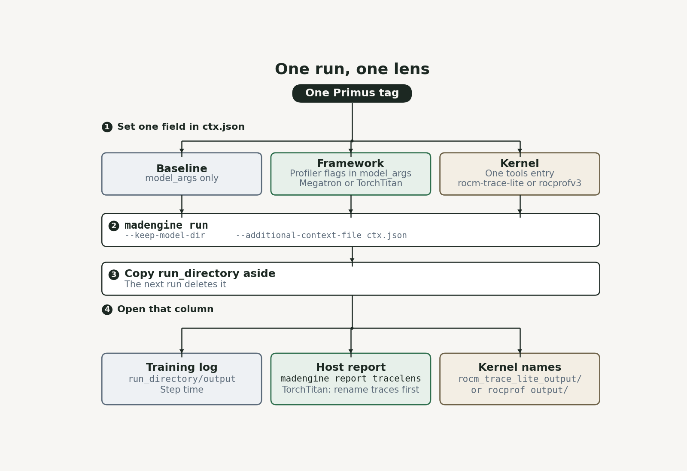
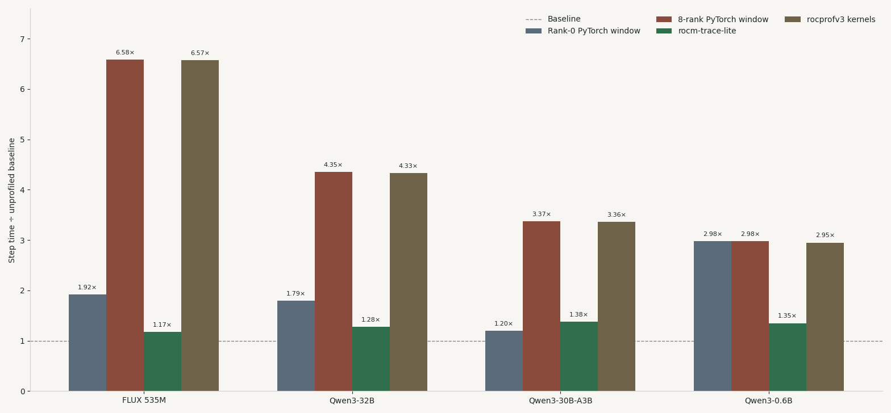
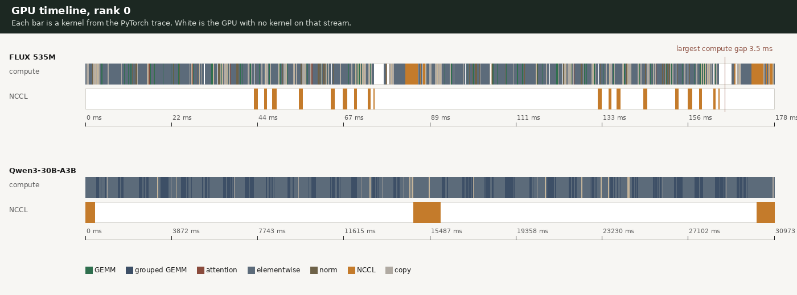
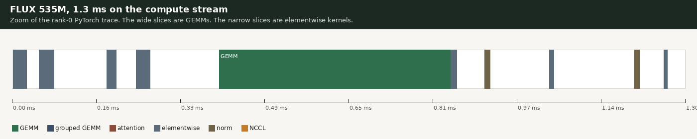
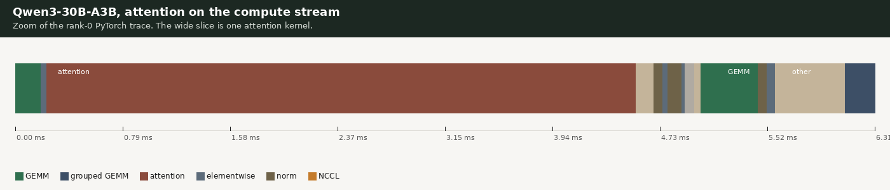
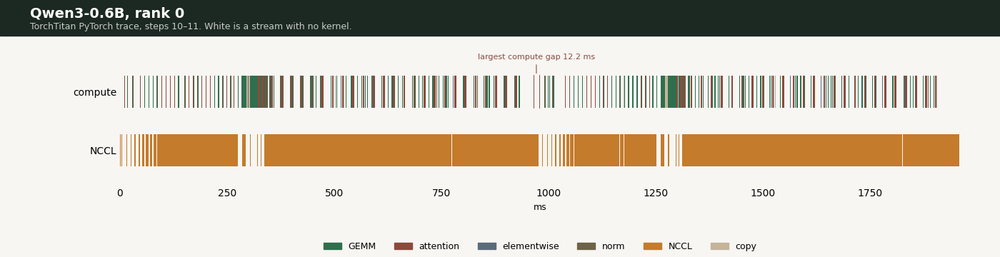
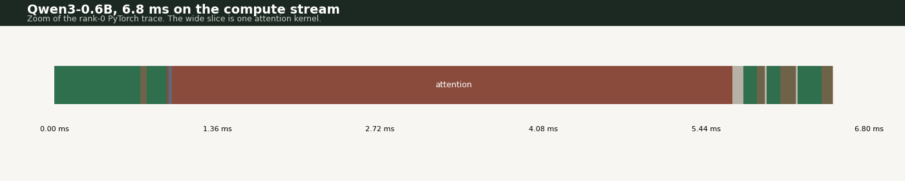
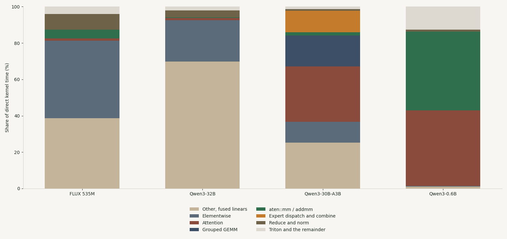
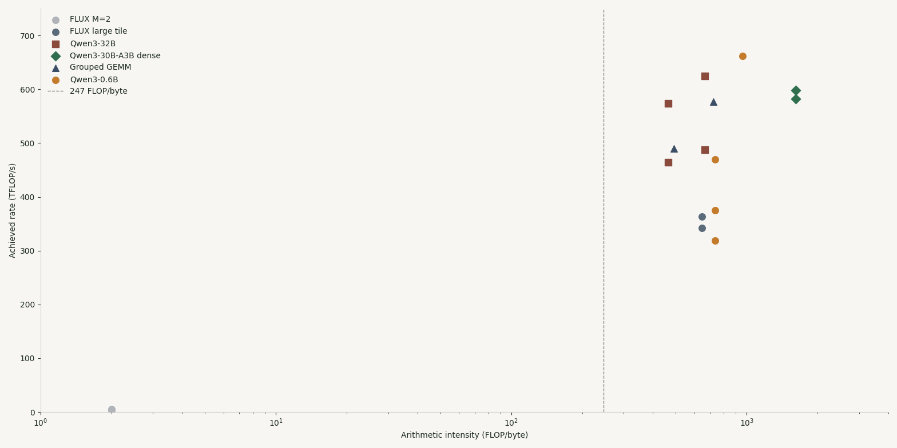

# From Operator to Kernel: Profile Primus Training with madengine

A slow Primus step can sit in the operators, in the GPU kernels those operators launch, or in the gap between them. Each layer has its own collector, and stacking collectors in one run mixes their overhead into the step time.

This is the hands-on. You keep one model tag and change one field in `--additional-context`. That field selects the lens. After the job, the sections below say which file to open and which number is the training step. The worked examples are four single-node jobs on 8× AMD Instinct MI300X, from the image `rocm/primus:v26.7`.

| Workload | Backend | Tag |
| --- | --- | --- |
| FLUX 535M | Megatron diffusion | `primus_train/megatron_MI300X_flux_535m_pretrain` |
| Qwen3-32B SFT | Megatron-Bridge | `primus_train/megatron_bridge_MI300X_qwen3_32b_sft_posttrain` |
| Qwen3-30B-A3B FP8 | Megatron-LM | `primus_train/megatron_MI300X_qwen3_30B_A3B-FP8-pretrain` |
| Qwen3-0.6B | TorchTitan | `primus_train/torchtitan_MI300X_qwen3_0.6B-pretrain` |

## The profilers

Four tools cover the path from the operator to the kernel. The first three collect a trace during `madengine run`. Use one collector per run. [TraceLens](https://rocm.blogs.amd.com/software-tools-optimization/tracelens/README.html) runs on the host after the job and reads a trace a collector already wrote.

**PyTorch profiler** is the operator lens. Primus and TorchTitan call [`torch.profiler`](https://pytorch.org/docs/stable/profiler.html) for a few training steps and write a Chrome trace. That file names the operators, the input shapes, and the collectives.

**[rocm-trace-lite](https://sunway513.github.io/rocm-trace-lite/index.html)** is the kernel-dispatch lens. It intercepts the HSA runtime, timestamps each GPU kernel launch, and writes a SQLite database at `rocm_trace_lite_output/trace.db`.

**[rocprofv3](https://rocm.docs.amd.com/projects/rocprofiler-sdk/en/latest/how-to/using-rocprofv3.html)** is the profiler in ROCm's rocprofiler-sdk. It can record kernels, HIP API calls, memory copies, and hardware counters. This article records kernels and memory copies as JSON under `rocprof_output/`. The trace covers the whole process. madengine also ships other `rocprofv3_*` presets. Each preset is its own run.

**TraceLens** reads the finished trace and writes the GPU timeline, the operator mix, the GEMM roofline, and the collective sizes. The command is `madengine report tracelens`. The reports in this post come from the PyTorch trace. The same command also reads rocprofv3 JSON and Perfetto traces.



*Figure 1. One field in `ctx.json`, then one `madengine run`. Copy `run_directory` aside before the next run. The framework column is the one that continues to `madengine report tracelens`. For TorchTitan, rename `rankN_trace.json` first.*

| Lens | Question it answers | How you select it | Where the files land |
| --- | --- | --- | --- |
| Baseline | What is the step time with no profiler? | `model_args` only | Training log under `run_directory/output` |
| Framework | Which operators, shapes, and collectives? | Append that backend's profiler flags to `model_args` | PyTorch traces under `run_directory`. TorchTitan writes `outputs/profile_traces/` |
| Kernel dispatch | Did every GPU record kernel launches? | `"tools": [{"name": "rocm_trace_lite"}]` | `rocm_trace_lite_output/` |
| Runtime kernels | What kernel names did rocprofv3 record? | `"tools": [{"name": "rocprofv3_lightweight", ...}]` | `rocprof_output/` |
| Analysis | How do I read the trace? | `madengine report tracelens` on the host | `gpu_timeline.csv`, `ops_summary*.csv`, `GEMM.csv`, `nccl_summary_long.csv` |

## Setup

Run from the MAD repository root, with `madengine` on `PATH`. Install the report command on the host:

```bash
pip install 'madengine[tracelens]'
```

Create a writable cache directory and use it in `docker_mounts`. Primus downloads weights and writes converted checkpoints there. `PRIMUS_WORKSPACE` puts logs and PyTorch traces under `run_directory`, which `--keep-model-dir` leaves on the host.

The next `madengine run` deletes `run_directory`. Copy it aside before the next command:

```bash
mkdir -p /path/to/cache/hf /path/to/cache/primus_data
cp -a run_directory "$HOME/traces/flux-baseline"
```

Save the context below as `ctx.json`. Every later command is this file plus one edit.

```json
{
  "gpu_vendor": "AMD",
  "guest_os": "UBUNTU",
  "docker_env_vars": {
    "PRIMUS_WORKSPACE": "/myworkspace/run_directory/output",
    "DATA_PATH": "/myworkspace/.blog_cache/primus_data",
    "MOUNT_DATA_PATH": "/myworkspace/.blog_cache/primus_data",
    "HF_HOME": "/myworkspace/.blog_cache/hf"
  },
  "docker_mounts": {"/myworkspace/.blog_cache": "/path/to/cache"},
  "model_args": "--config_path examples/megatron/configs/MI300X/diffusion/flux_535m_pretrain.yaml --train_iters 100 --log_interval 1 --attention_backend fused"
}
```

`--attention_backend fused` is required for FLUX on `rocm/primus:v26.7`. The image exports attention flags that Megatron's `auto` backend rejects. Qwen3-32B needs `--lr_warmup_iters 5`, because the config default of 50 is not below a 30-iteration run. Its profiler also needs `--logger.tensorboard_dir /myworkspace/run_directory/output/tensorboard`, or the trace is written into the image and discarded with the container.

## Run the baseline

Run this twice. The two medians, over steps 5 and later, are the noise floor. On these jobs they differed by 0.86%, 0.23%, 0.30%, and 0.69%.

```bash
madengine run \
  --tags primus_train/megatron_MI300X_flux_535m_pretrain \
  --keep-model-dir \
  --timeout 7200 \
  --additional-context-file ctx.json
```

Read the step time from the training log in `run_directory/output`, steps 5 and later. FLUX logs images/s on the last rank. `madengine run` still exits non-zero for FLUX, because the perf extractor looks for tokens/s. The log and the traces are written.

| Workload | Steady step | What the training log reported |
| --- | ---: | --- |
| FLUX 535M | 46.3 ms | 43.5 images/s/GPU, 270 TFLOP/s/GPU |
| Qwen3-32B SFT | 1.116 s | global batch 8, sequence 8192 |
| Qwen3-30B-A3B FP8 | 12.91 s | 10,067 tokens/s/GPU, 229 TFLOP/s/GPU |
| Qwen3-0.6B | 329 ms | 49,800 tokens/s/GPU, 272 TFLOP/s/GPU, 21% MFU |

Table 1. Unprofiled step time. Qwen3-32B is reported as a step time. The Megatron-Bridge perf extractor's TFLOP/s and MFU are above the published MI300X peak, so they are left out. The log TFLOP/s on FLUX, Qwen3-30B-A3B, and Qwen3-0.6B divides model FLOPs by the whole step. Qwen3-0.6B's 272 TFLOP/s and 21% MFU are the training log's own medians, and both sit under the published peak.

## Run the framework lens

Edit `model_args` in `ctx.json`. Keep the config path and the iteration flags. Append the profiler flags. The blocks in this section are Megatron and Megatron-Bridge. `profile_step_end 12` records steps 10 and 11. TorchTitan uses a different schedule, in the TorchTitan section below.

Rank 0, with shapes. This is the trace TraceLens uses for the timeline, the operator mix, and the roofline.

```text
--profile True --use_pytorch_profiler True --profile_step_start 10 --profile_step_end 12 --torch_profiler_with_stack False --torch_profiler_record_shapes True --profile_ranks [0]
```

All eight ranks, shapes off. This is the collective report. Shapes off keeps the eight files smaller. Message size is still recorded.

```text
--profile True --use_pytorch_profiler True --profile_step_start 10 --profile_step_end 12 --torch_profiler_with_stack False --torch_profiler_record_shapes False --profile_ranks [0,1,2,3,4,5,6,7]
```

Run the same `madengine run` as the baseline. Then, on the host:

```bash
madengine report tracelens --root run_directory --mode pytorch --gpu-arch MI300X
madengine report tracelens --root run_directory --mode collective --world-size 8
```

`--gpu-arch MI300X` labels a GEMM compute-bound or memory-bound. Pass `--python` if TraceLens is installed in another interpreter. The PyTorch report writes a `*_csv` directory next to the trace. Open these files in order:

| File | What you learn |
| --- | --- |
| `gpu_timeline.csv` | Computation, exposed communication, memcpy, idle, as shares of the captured window |
| `ops_summary_by_category.csv` | Which family holds the direct kernel time |
| `ops_summary.csv` | The leaf CPU op that launched that time |
| `ops_unique_args.csv` | The input shape behind a leaf op |
| `GEMM.csv` | M, N, K, FLOP/byte, TFLOP/s for `aten::mm` and `aten::addmm` |
| `GroupedGEMM_fwd.csv` | The same roofline for grouped GEMMs, when the model has them |
| `nccl_summary_long.csv` | Collective name, dtype, and message size |

Megatron-Bridge uses a different flag spelling. Replace the two blocks above with:

```text
--profiling.use_pytorch_profiler True --profiling.profile_step_start 10 --profiling.profile_step_end 12 --logger.tensorboard_dir /myworkspace/run_directory/output/tensorboard --profiling.record_shapes True --profiling.profile_ranks [0]
```

```text
--profiling.use_pytorch_profiler True --profiling.profile_step_start 10 --profiling.profile_step_end 12 --logger.tensorboard_dir /myworkspace/run_directory/output/tensorboard --profiling.record_shapes False --profiling.profile_ranks [0,1,2,3,4,5,6,7]
```

## Run rocm-trace-lite

Remove the profiler flags from `model_args` so this run matches the baseline length. Replace any `tools` entry with one collector:

```json
"tools": [{"name": "rocm_trace_lite"}]
```

```bash
madengine run \
  --tags primus_train/megatron_MI300X_flux_535m_pretrain \
  --keep-model-dir \
  --timeout 7200 \
  --additional-context-file ctx.json
```

Open `rocm_trace_lite_output/`. A useful trace has `KernelExecution` rows on GPU ids 0 through 7. `UserMarker` rows at gpu id −1 are host markers. A trace that contains only those markers did not capture GPU kernels.

On these jobs the whole-run step was 1.17× (FLUX), 1.28× (Qwen3-32B), 1.38× (Qwen3-30B-A3B), and 1.35× (Qwen3-0.6B) the baseline. The traces held 931,538, 4,073,773, 23,078,713, and 674,577 kernel dispatches. That step time is the cost of the tool. The baseline in Table 1 remains the training step.

## Run rocprofv3

Use a separate run. The command measured here is kernel and memory-copy trace, written as JSON. The stock `rocprofv3_lightweight` preset also passes `--hip-trace`, which on FLUX recorded many more host API rows than kernels. The override below leaves that flag off. The trailing `--` is required.

```json
"tools": [{
  "name": "rocprofv3_lightweight",
  "cmd": "bash ../scripts/common/tools/rocprof_wrapper.sh --kernel-trace --memory-copy-trace --output-format json -d ./rocprof_output --"
}]
```

rocprofv3 traces the whole process. For the two language models, `--train_iters 20` keeps the JSON to about 1 GB per rank on Qwen3-30B-A3B. FLUX stayed at 100 iterations. The wrapper stores the files under `rocprof_output/` even though Primus changes directory before the training process starts.

The cropped steps 10–11 were 6.57×, 4.33×, and 3.36× the baseline step. Kernel durations from that window agree with the rank-0 PyTorch GEMMs on FLUX, within 3.7%. They miss that bar on Qwen3-32B attention and on the short FP8 tiles of Qwen3-30B-A3B. On Qwen3-0.6B the same command covers the whole 20-step run: the median step is 2.95× the 329 ms baseline, each rank's JSON is about 80 MB, and the names are Cijk GEMMs, AITER FMHA forward, CK-tile FMHA backward, and `ncclDevKernel_Generic`. Use this output to confirm kernel names. Keep durations from Table 1 and from the MoE PyTorch window.

## Run the other models

Copy `ctx.json`. Change `--tags` on the command line and `model_args` in the file. Then repeat the baseline, the framework lens, rocm-trace-lite, and rocprofv3. One tag per command.

| Workload | `--tags` | Baseline `model_args` |
| --- | --- | --- |
| Qwen3-32B SFT | `primus_train/megatron_bridge_MI300X_qwen3_32b_sft_posttrain` | `--config_path examples/megatron_bridge/configs/MI300X/qwen3_32b_sft_posttrain.yaml --train_iters 30 --log_interval 1 --lr_warmup_iters 5` |
| Qwen3-30B-A3B | `primus_train/megatron_MI300X_qwen3_30B_A3B-FP8-pretrain` | `--config_path examples/megatron/configs/MI300X/qwen3_30B_A3B-FP8-pretrain.yaml --train_iters 30 --log_interval 1` |

Qwen3-30B-A3B uses the same Megatron profiler flags as FLUX. Qwen3-32B uses the Megatron-Bridge flags in the framework section. For rocprofv3 on either language model, set `--train_iters 20` and keep `--lr_warmup_iters 5` on Qwen3-32B. Qwen3-0.6B is the TorchTitan job in the next section.

## Run TorchTitan Qwen3-0.6B

Primus writes a TraceLens report from the Megatron trainer family. TorchTitan has the PyTorch profiler and does not call that generator. This job is the host path: `madengine run` collects the trace, and `madengine report tracelens` on the host writes the CSVs. Megatron-Bridge is the same situation for Qwen3-32B. TorchTitan is the one whose filenames the report command does not discover on its own.

The config is `examples/torchtitan/configs/MI300X/qwen3_0.6B-pretrain.yaml`. The trainer log reports 596,049,920 dense parameters, local batch 4, global batch 32, sequence length 4096, and FSDP across the eight GPUs. `training.mock_data` is true, so this run does not download model weights. The prepare step still resolves `model.hf_assets_path` (`Qwen/Qwen3-0.6B`) and expects the tokenizer files on disk.

Add the tokenizer directory to `docker_mounts`, and keep the cache mount from the setup section. When that prepare step needs a Hugging Face token, set `HF_TOKEN` in `docker_env_vars` to your own token. Leave the token out of any file you commit or publish.

```json
"docker_mounts": {
  "/workspace/Primus/data/torchtitan/Qwen3-0.6B": "/path/to/qwen3-0.6B-tokenizer"
}
```

The baseline `model_args` are:

```text
--config_path examples/torchtitan/configs/MI300X/qwen3_0.6B-pretrain.yaml --training.steps 30 --metrics.log_freq 1
```

Run the baseline twice, the same way as FLUX. Copy `run_directory` aside between the two commands.

```bash
madengine run \
  --tags primus_train/torchtitan_MI300X_qwen3_0.6B-pretrain \
  --keep-model-dir \
  --timeout 7200 \
  --additional-context-file ctx.json
```

The two medians, steps 5 and later, are 328.1 ms and 330.3 ms. Table 1 uses their mean, 329 ms. Step time in the table is `16384 / tps`, because the log's `tps` is tokens per second per device and the local token count is 4 × 4096.

### Framework lens

TorchTitan does not take `--profile_step_start`. It takes a schedule. `profile_freq` is the cycle length. `profiler_warmup` and `profiler_active` are the warmup and active steps inside that cycle, and their sum has to stay within `profile_freq`. This run uses a cycle of 11, warmup 3, and active 2, so the wait is 6 and the active training steps are 10 and 11. The trace is written at step 11. Every rank is recorded, and shapes stay on. One `madengine run` is both the rank-0 timeline and the 8-rank collective report.

Set `--training.steps 20` on this run and append:

```text
--profiling.enable_profiling true --profiling.profiler_active 2 --profiling.profiler_warmup 3 --profiling.profile_freq 11
```

```bash
madengine run \
  --tags primus_train/torchtitan_MI300X_qwen3_0.6B-pretrain \
  --keep-model-dir \
  --timeout 7200 \
  --additional-context-file ctx.json
```

The files land at `run_directory/outputs/profile_traces/iteration_11/rankN_trace.json`, about 22 MB each. `madengine report tracelens` looks for `*.pt.trace.json`. A file named `rank0_trace.json` is skipped. Copy iteration 11 and rename it, then run the report twice. A second cycle has already started by step 20 and leaves a few-kilobyte file under `iteration_20`. Leave that directory out.

```bash
mkdir -p traces/rank0 traces/ranks
for r in 0 1 2 3 4 5 6 7; do
  cp "run_directory/outputs/profile_traces/iteration_11/rank${r}_trace.json" \
     "traces/ranks/rank${r}.pt.trace.json"
done
cp traces/ranks/rank0.pt.trace.json traces/rank0/rank0.pt.trace.json

madengine report tracelens \
  --root traces/rank0 \
  --output-dir tracelens/pytorch \
  --mode pytorch \
  --gpu-arch MI300X

madengine report tracelens \
  --root traces/ranks \
  --output-dir tracelens/collective \
  --mode collective \
  --world-size 8
```

Pass `--python` when TraceLens is in another interpreter. The PyTorch command writes `tracelens/pytorch/rank0_csv/`. The collective command writes `tracelens/collective/multi_rank_collective_csv/nccl_summary_long.csv`. Those CSVs are the Qwen3-0.6B columns in Tables 2 through 6.

### rocm-trace-lite and rocprofv3

Take the profiler flags back off. For rocm-trace-lite, restore `--training.steps 30` and set the same `rocm_trace_lite` entry as the earlier section. For rocprofv3, set `--training.steps 20` and use the kernel-and-memory-copy override from the rocprofv3 section. Run each as its own `madengine run`. Figure 2 includes both.

## What you can quote

Read this before treating a CSV cell as the training step.

| Quantity | Use it as |
| --- | --- |
| Baseline step, two runs | The training step |
| Log throughput on FLUX, Qwen3-30B-A3B, and Qwen3-0.6B | The training log's own rate. On Qwen3-0.6B, 272 TFLOP/s and 21% MFU sit under the published MI300X peak |
| Qwen3-32B extractor TFLOP/s and MFU | Leave them out. They sit above the published MI300X peak |
| Collective message size | The payload. Leave `dur_mean`, and any bandwidth from it, unread. The 8-rank window is 6.58×, 4.35×, and 3.37×. On Qwen3-0.6B the eight ranks are the same 2.98× capture as rank 0 |
| Qwen3-30B-A3B kernel time and mix | The kernels. The rank-0 window is 1.20×, and steps outside it match the baseline to 0.03% |
| Category shares on FLUX, Qwen3-32B, and Qwen3-0.6B | Shares of a slowed window (1.92×, 1.79×, and 2.98×) |
| Idle and exposed-communication percent | Shares of the captured window |
| `GEMM.csv` TFLOP/s | A kernel rate for the shapes TraceLens modeled. On Qwen3-0.6B that rate is inside the 2.98× window |
| rocprofv3 kernel durations | Leave them out, except as a cross-check of the FLUX GEMM medians |



*Figure 2. How far each lens moved the step, relative to Table 1. Short steps move further. rocm-trace-lite stays the closest whole-run collector. On Qwen3-0.6B the rank-0 bar and the 8-rank bar are both 2.98×, because TorchTitan recorded every rank in that one window. rocprofv3 on that job is the whole 20-step run, 2.95×.*

## Read the timeline

`gpu_timeline.csv` splits the captured window. `computation_time` is the union of non-collective GPU work. `exposed_comm_time` is communication that is outside that compute. These percents are of the window.

| Workload | Computation | Exposed comm | Busy | Idle | Window, two steps |
| --- | ---: | ---: | ---: | ---: | ---: |
| FLUX 535M | 31.2 ms, 17.5% | 19.3 ms, 10.8% | 28.5% | 71.5% | 177.9 ms |
| Qwen3-32B SFT | 862 ms, 21.6% | 1,175 ms, 29.4% | 51.0% | 49.0% | 3,999 ms |
| Qwen3-30B-A3B | 24,559 ms, 79.3% | 44.9 ms, 0.14% | 79.5% | 20.5% | 30,973 ms |
| Qwen3-0.6B | 689 ms, 35.1% | 1,201 ms, 61.3% | 96.5% | 3.5% | 1,960 ms |

Table 2: Rank-0 window, steps 10 and 11. Qwen3-0.6B is the TorchTitan capture. Its busy share is high because exposed communication fills time the compute stream is idle. That idle is inside a 2.98× window. On that same run, steps 13 through 17 are back at 321–364 ms, in line with Table 1.

A useful check is to multiply the computation share by the window stretch from Table 1. That product is about 34% of the 46.3 ms FLUX step, 39% of the 1.116 s Qwen3-32B step, and 95% of the 12.91 s Qwen3-30B-A3B step. It matches an independent sum of non-collective kernel intervals (15.8 ms, and 12.28 s on the MoE model). It is a check that the two views describe the same run. It is a separate measurement of the unprofiled step only for Qwen3-30B-A3B, where the window itself is 1.20×.

On Qwen3-30B-A3B, exposed NCCL is 0.14% of the window. The step is GPU kernels. On FLUX, Qwen3-32B, and Qwen3-0.6B the idle and exposed-communication shares describe the profiled window, including the slowdown from tracing. Multiplying Qwen3-0.6B's 35% compute share by 2.98× overshoots the 329 ms step, so that row does not reconstruct the unprofiled step. Figure 6 is that window.

The rank-0 PyTorch file is a Chrome trace. After the framework run it is under `run_directory/output`, named `*.pt.trace.json` or `*.pt.trace.json.gz`. Open [ui.perfetto.dev](https://ui.perfetto.dev), choose **Open trace file**, and load that file. Expand the GPU stream tracks. The CPU Python tracks are the host side. The discovery is on the GPU streams: kernel slices on one track, NCCL on another, and white wherever that stream has no kernel.

FLUX's rank-0 file is under 1 MB compressed, so it opens directly. Qwen3-30B-A3B's is about 50 MB. The rocprofv3 JSON also opens in Perfetto, and its time axis is the slowed window from Figure 2, so use it to read kernel names rather than step time.

The pictures below are those kernel slices. FLUX and Qwen3-30B-A3B come from `*.pt.trace.json`. Qwen3-0.6B comes from `rank0_trace.json` after the rename in the TorchTitan section. That file is about 22 MB.



*Figure 3. Full captured window, rank 0. White is a stream with no kernel. FLUX's compute stream is interrupted, and its largest gap is 3.5 ms. Qwen3-30B-A3B's compute stream stays busy across the 31 s window, and NCCL is three short blocks on the other track. This white includes profiler time, so it is the shape of the trace, not the idle percent of the unprofiled step.*



*Figure 4. FLUX, 1.3 ms on the compute stream. The wide green slice is one GEMM, about 0.27 ms. The blue slices are elementwise kernels of about 0.02 ms. The white between them is launch and host gap. Table 3 summarizes that pattern as 43% elementwise.*



*Figure 5. Qwen3-30B-A3B, 6.3 ms on the compute stream. The wide red slice is one attention kernel, 4.2 ms. A GEMM and a grouped GEMM follow it. Table 3 is the same view as shares: 26% attention and 17% grouped GEMM.*



*Figure 6. Qwen3-0.6B, full captured window, rank 0, steps 10 and 11 (1,960 ms). The longest gap on the compute stream is 12.2 ms, and NCCL covers that gap. Table 2 is this picture: computation is 35% of the window and exposed communication is 61%. The window is 2.98× the 329 ms step.*



*Figure 7. Qwen3-0.6B, 6.8 ms on the compute stream. The wide red slice is one attention-backward kernel, 4.6 ms. The green slices are GEMMs. Table 4 is the same view as leaf ops: 43% `aten::mm` and 35% `aiter::mha_bwd`.*

## Read the kernel mix

`ops_summary_by_category.csv` rolls leaf CPU ops into families. The time is kernels launched directly by that op, so a parent and a child are not both counted. TraceLens files fused `_Linear` and `_LayerNormLinear` modules under `other`. The `GEMM` row is only `aten::mm` and `aten::addmm`.



*Figure 8. Share of direct kernel time on the four example runs. Table 3 lists the same shares. On Qwen3-0.6B the tan band is about 1%, and the green `aten::mm` band is the GEMM time. The light band on that job is Triton plus `record_param_comms` and the multi-tensor kernels.*

| Category | FLUX 535M | Qwen3-32B | Qwen3-30B-A3B | Qwen3-0.6B |
| --- | ---: | ---: | ---: | ---: |
| Other, including fused linears | 38.7% | 69.8% | 25.2% | 1.0% |
| Elementwise | 42.6% | 22.8% | 11.5% | 0.5% |
| Attention | 1.3% | 1.2% | 30.4% | 41.5% |
| Grouped GEMM | — | — | 17.0% | — |
| `aten::mm` / `addmm` | 4.8% | 0.4% | 1.9% | 43.3% |
| Expert dispatch and combine | — | — | 11.7% | — |
| Reduce | 5.4% | 3.8% | 1.0% | 1.0% |
| Norm | 3.1% | — | — | 0.05% |

Table 3: The same shares as Figure 8. Attention on Qwen3-30B-A3B is `SDPA_bwd` 25.8% plus `SDPA_fwd` 4.6%. On Qwen3-0.6B it is `aiter::mha_bwd` 34.7% plus `aiter::fmha_v3_fwd` 6.8%. The 1.0% "other" on that job is not a fused linear. Triton, 8.4%, sits in the light band of Figure 8 with `record_param_comms` (2.7%) and the multi-tensor kernels (1.5%).

Then open `ops_summary.csv` and sort by kernel time. The leaf ops that hold these jobs:

| Workload | Operation | Count | Kernel time | Share |
| --- | --- | ---: | ---: | ---: |
| FLUX 535M | `_LinearBackward` | 24 | 6.53 ms | 20.8% |
| FLUX 535M | `aten::add_` | 152 | 5.36 ms | 17.1% |
| FLUX 535M | `_Linear` | 24 | 3.35 ms | 10.7% |
| FLUX 535M | `aten::mul` | 168 | 2.16 ms | 6.9% |
| Qwen3-32B | `_LayerNormLinearBackward` | 256 | 190 ms | 21.9% |
| Qwen3-32B | `CheckpointFunction` | 128 | 103 ms | 11.9% |
| Qwen3-32B | `_LinearBackward` | 256 | 84 ms | 9.6% |
| Qwen3-32B | `aten::mul_` | 2 | 70 ms | 8.1% |
| Qwen3-30B-A3B | `aiter::mha_bwd` | 1,536 | 6,357 ms | 25.8% |
| Qwen3-30B-A3B | `primus_turbo::grouped_gemm_impl` | 6,144 | 4,172 ms | 17.0% |
| Qwen3-30B-A3B | `primus_turbo::grouped_gemm_variable_k_accum_impl` | 3,072 | 2,574 ms | 10.5% |
| Qwen3-30B-A3B | `aiter::fmha_v3_fwd` | 1,536 | 1,139 ms | 4.6% |
| Qwen3-0.6B | `aten::mm` | 1,182 | 304 ms | 43.3% |
| Qwen3-0.6B | `aiter::mha_bwd` | 56 | 244 ms | 34.7% |
| Qwen3-0.6B | `aiter::fmha_v3_fwd` | 56 | 47 ms | 6.8% |
| Qwen3-0.6B | `record_param_comms` | 2 | 19 ms | 2.7% |

Table 4: Largest leaf operations, two captured steps, rank 0. `ops_unique_args.csv` is the next file when you want the shape behind one of these names.

FLUX spends the window on fused linears and on many short elementwise kernels. Qwen3-32B spends it on fused layer-norm linears and activation checkpointing. Qwen3-30B-A3B spends it on AITER attention and Primus Turbo grouped GEMMs. Its expert exchange is `MoEDispatch` and `MoECombineBackward` (2.7% and 3.5% of kernel time). That traffic is overlapped with compute, which is why the NCCL bucket in Table 2 is 0.14%. Qwen3-0.6B spends the window on `aten::mm` and AITER attention. The 56 attention calls are the 28 layers across the two active steps. Figure 7 is one of those attention kernels.

## Read the roofline

`GEMM.csv` computes FLOPs and bytes from the operator arguments (`2·M·N·K`, and the three matrices) and divides by the kernel duration in the trace. Published MI300X peaks, used here as the reference and not measured in these runs, are 1,307 TFLOP/s bf16 and 5.3 TB/s. The ridge is near 247 FLOP/byte. A point well to the left of that line is bandwidth-bound. A point to the right is compute-bound, and its TFLOP/s can be compared with the 1,307 TFLOP/s peak.



*Figure 9. GEMMs TraceLens could model, from the four example runs. FLUX has a compute-bound tile near 363 TFLOP/s and M=2 tiles at 4–6 TFLOP/s, left of the 247 FLOP/byte line. Grouped GEMMs are the blue triangles. Qwen3-0.6B is the orange circles, all to the right of that line.*

| Workload | Op | M | N | K | FLOP/byte | TFLOP/s | Bound |
| --- | --- | ---: | ---: | ---: | ---: | ---: | --- |
| FLUX | `aten::mm` | 3072 | 4096 | 1024 | 647 | 363 | compute, 51% of roofline |
| FLUX | `aten::mm` | 1024 | 3072 | 4096 | 647 | 342 | compute, 48% of roofline |
| FLUX | `aten::addmm` | 2 | 18432 | 3072 | 2.0 | 3.7 | memory |
| FLUX | `aten::mm` | 2 | 3072 | 18432 | 2.0 | 5.9 | memory |
| Qwen3-32B | `aten::mm` | 768 | 5120 | 75968 | 662 | 625 | compute, 88% of roofline |
| Qwen3-32B | `aten::mm` | 512 | 5120 | 75968 | 463 | 574 | compute, 81% of roofline |
| Qwen3-32B | `aten::mm` | 768 | 75968 | 5120 | 662 | 488 | compute, 69% of roofline |
| Qwen3-32B | `aten::mm` | 512 | 75968 | 5120 | 463 | 464 | compute, 66% of roofline |
| Qwen3-30B-A3B | `aten::mm` | 8192 | 2048 | 131200 | 1,618 | 598 | compute, 85% of roofline |
| Qwen3-30B-A3B | `aten::mm` | 8192 | 131200 | 2048 | 1,618 | 582 | compute, 82% of roofline |
| Qwen3-30B-A3B | grouped GEMM | 65536 | 2048 | 1536 | 723 | 577 | compute |
| Qwen3-30B-A3B | grouped GEMM | 65536 | 2048 | 768 | 492 | 490 | compute |
| Qwen3-0.6B | `aten::mm` | 3072 | 1024 | 16384 | 734 | 319 | compute, 45% of roofline |
| Qwen3-0.6B | `aten::mm` | 16384 | 1024 | 3072 | 734 | 375 | compute, 53% of roofline |
| Qwen3-0.6B | `aten::mm` | 16384 | 3072 | 1024 | 734 | 470 | compute, 66% of roofline |
| Qwen3-0.6B | `aten::mm` | 16384 | 1024 | 151936 | 958 | 662 | compute, 94% of roofline |

Table 5: Median over the captured calls. Grouped GEMMs are `primus_turbo::grouped_gemm_impl` with 16 groups, from `GroupedGEMM_fwd.csv`. Qwen3-32B's fused linears are most of its kernel time and have no row here. The four `aten::mm` shapes on Qwen3-32B are a short `M` against a packed `K` of 75,968. Qwen3-0.6B's rows are kernel rates inside the 2.98× window. TraceLens wrote no attention roofline for that trace: the GQA head sizes it read are 16 and 8, and the FLOP model rejected that pair.

The FLUX training log says 270 TFLOP/s/GPU. Figure 9 shows why that single rate hides two kernels: one large tile at 363 TFLOP/s, and modulation tiles at 4–6 TFLOP/s. Qwen3-30B-A3B's log says 229 TFLOP/s/GPU for the whole step, while the grouped GEMMs and the two dense bf16 GEMMs run near 490–600 TFLOP/s. Qwen3-0.6B's log says 272 TFLOP/s/GPU for the unprofiled step. The orange points are the captured `aten::mm` tiles, from 319 to 662 TFLOP/s.

## Read the collectives

In `nccl_summary_long.csv`, use the collective name, the dtype, the group size, and `In msg size (MB)`. The rule for `dur_mean` is in the quote table above: the 8-rank capture includes GPUs waiting on each other.

| Workload | Collective | dtype | Group | Payload | Calls in the window |
| --- | --- | --- | ---: | ---: | ---: |
| FLUX 535M | reduce-scatter | fp32 | 8 | 360 MB | 2 |
| FLUX 535M | allgather | bf16 | 8 | 22.5 MB | 2 |
| Qwen3-32B | reduce-scatter | fp32 | 4 | 62,490 MB | 2 |
| Qwen3-32B | allgather | bf16 | 4 | 7,811 MB | 2 |
| Qwen3-30B-A3B | reduce-scatter | fp32 | 8 | 1,057 MB | 2 |
| Qwen3-0.6B | reduce-scatter | fp32 | 8 | 60 MB in, 7.5 MB out | 56 |
| Qwen3-0.6B | allgather | bf16 | 8 | 3.8 MB in, 30 MB out | 112 |

Table 6: Largest payloads on rank 0. A call count of 2 is one collective in each of steps 10 and 11. Qwen3-0.6B's counts are once per layer per step for reduce-scatter and twice per layer per step for allgather.

Qwen3-32B's 62.5 GB fp32 reduce-scatter is a gradient buffer across a group of 4. The matching allgather is the bf16 shard, 7.8 GB. FLUX and Qwen3-30B-A3B move a few hundred megabytes to about 1 GB. Qwen3-0.6B's FSDP traffic is a 60 MB fp32 reduce-scatter and a 30 MB bf16 allgather, one process group of ranks 0–7. On Qwen3-30B-A3B the expert path is the Primus Turbo dispatch and combine in Table 4, not this NCCL reduce-scatter.

## Summary

**FLUX is a short step.** The GPU is computing for about a third of the 46.3 ms baseline. Of the kernel time in the window, 43% is elementwise and 31% is `_Linear` plus `_LinearBackward`. The large GEMM is compute-bound. The `M=2` GEMMs are memory-bound. rocm-trace-lite adds about 17% to the whole run. The PyTorch window and the rocprofv3 window are several times the step, so their idle time is the profiler.

**Qwen3-32B is fused linears plus one large gradient exchange.** Kernel time sits in `_LayerNormLinear` and `_Linear`, with activation checkpointing beside them. The GEMMs TraceLens could roofline are fast and short on `M`. The data-parallel payload is 62.5 GB of fp32. Quote the size. The latency beside it was recorded inside a 4.4× window.

**Qwen3-30B-A3B is the kernel view you can quote in milliseconds.** About 95% of the unprofiled step lines up with GPU compute. AITER attention backward is 26% of kernel time, grouped GEMMs are the next family, and expert dispatch and combine are about 12% together. Two dense bf16 GEMMs run near 590 TFLOP/s. The 229 TFLOP/s in the log is the whole step.

**Qwen3-0.6B is the TorchTitan host report.** The step to quote is 329 ms. Inside the 2.98× window the kernels are `aten::mm` and AITER attention, and the FSDP payloads are 60 MB and 30 MB. Figure 2 is the collector cost: rocm-trace-lite at 1.35×, and rocprofv3 at 2.95× across the whole 20-step run.

## Additional resources

* [madengine on GitHub](https://github.com/ROCm/madengine)
* [TraceLens: Democratizing AI Performance Analysis](https://rocm.blogs.amd.com/software-tools-optimization/tracelens/README.html)
* [TraceLens on GitHub](https://github.com/AMD-AGI/TraceLens)
* [rocm-trace-lite](https://sunway513.github.io/rocm-trace-lite/index.html)
* [Using rocprofv3](https://rocm.docs.amd.com/projects/rocprofiler-sdk/en/latest/how-to/using-rocprofv3.html)
* [PyTorch profiler](https://pytorch.org/docs/stable/profiler.html)

## System configuration

8× AMD Instinct MI300X (gfx942). Image `rocm/primus:v26.7`. Framework traces for the Megatron jobs are the Primus PyTorch profiler, steps 10 and 11. The TorchTitan job uses its own profiler schedule (cycle 11, warmup 3, active 2) and writes `rankN_trace.json`; those files were renamed to `rankN.pt.trace.json` before the host report. All four jobs were analyzed with `madengine report tracelens --gpu-arch MI300X`. rocprofv3 is version 1.3.5 as shipped in the image, invoked with kernel and memory-copy trace only.

## Disclaimers

The performance numbers in this post are measurements from the runs described above. They are not official AMD benchmarks.

Third-party content is licensed to you directly by the third party that owns the content and is not licensed to you by AMD. ALL LINKED THIRD-PARTY CONTENT IS PROVIDED "AS IS" WITHOUT A WARRANTY OF ANY KIND. USE OF SUCH THIRD-PARTY CONTENT IS DONE AT YOUR SOLE DISCRETION AND UNDER NO CIRCUMSTANCES WILL AMD BE LIABLE TO YOU FOR ANY THIRD-PARTY CONTENT. YOU ASSUME ALL RISK AND ARE SOLELY RESPONSIBLE FOR ANY DAMAGES THAT MAY ARISE FROM YOUR USE OF THIRD-PARTY CONTENT.
