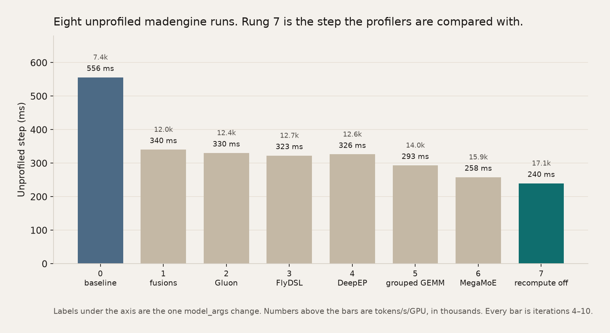
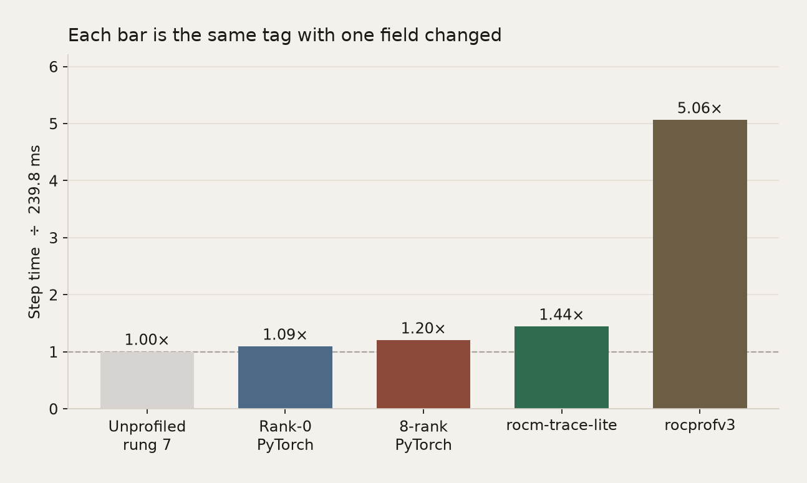
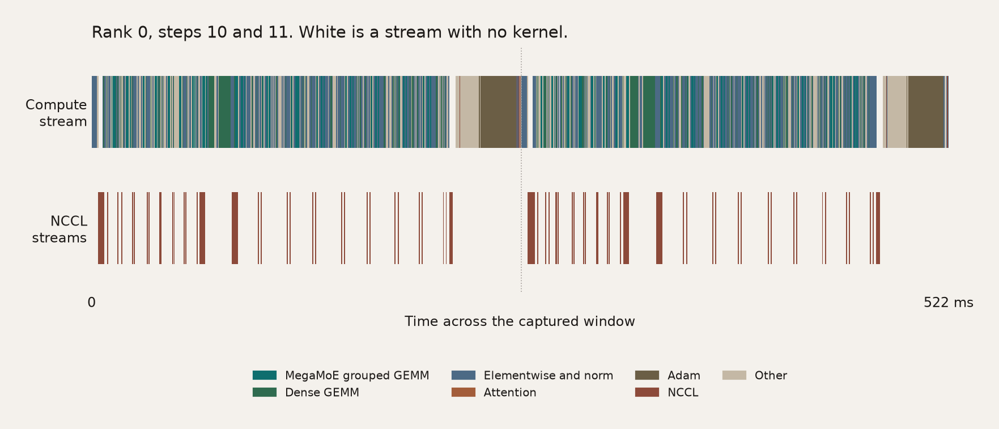
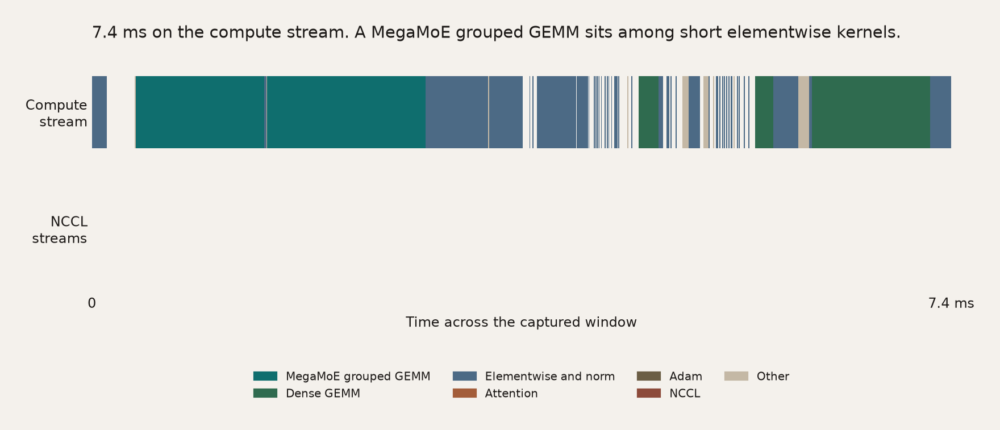
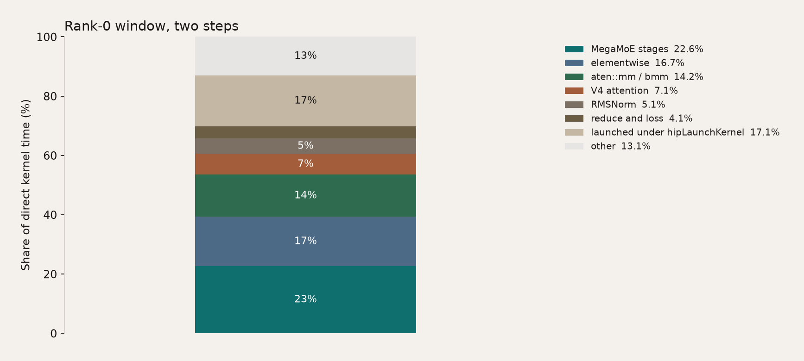
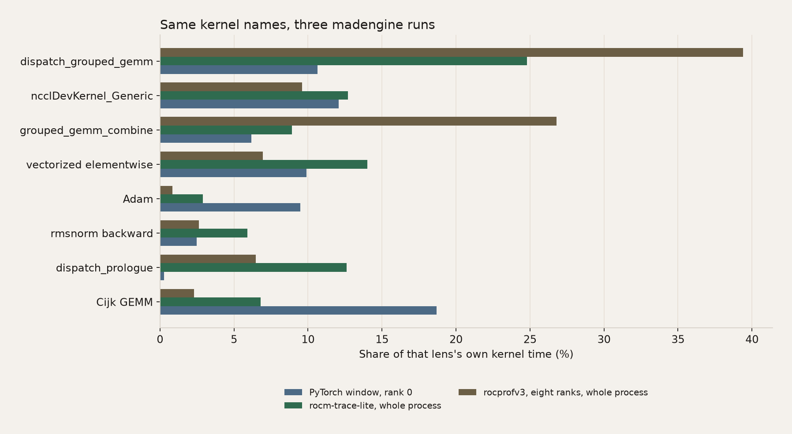
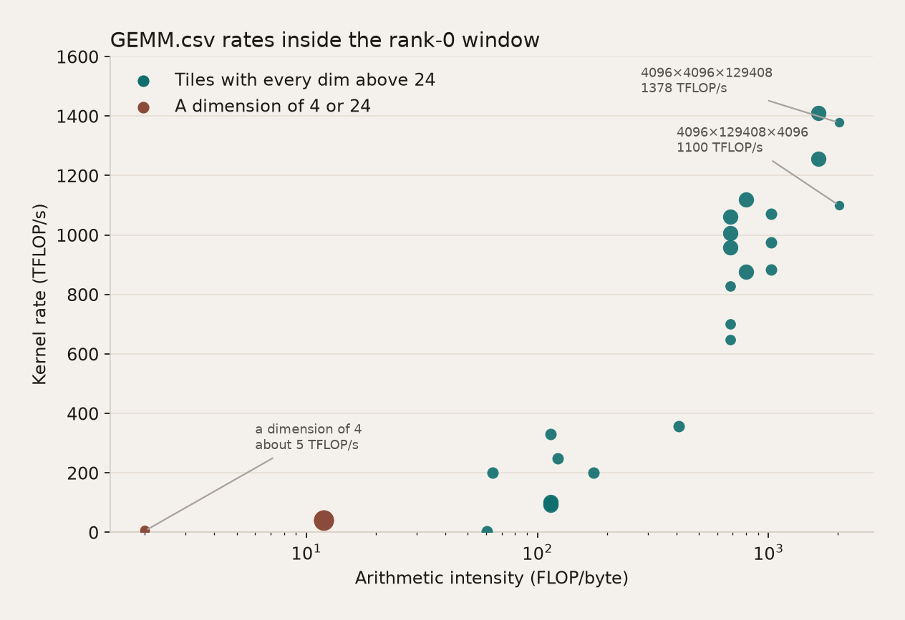
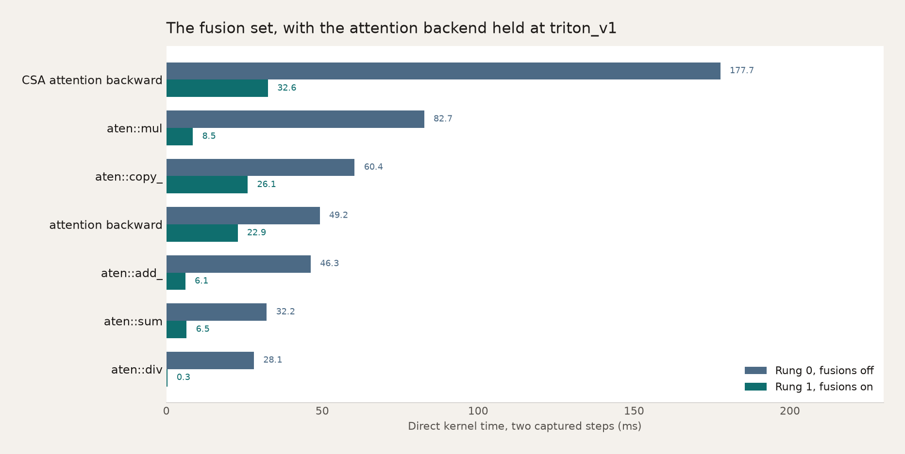
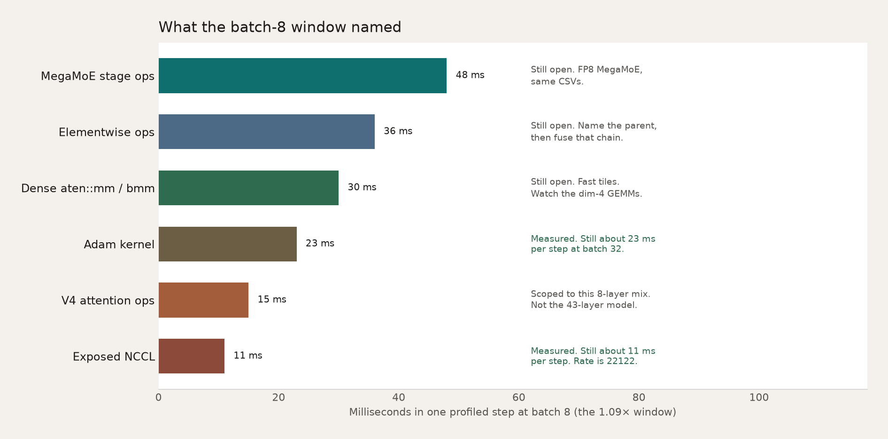

# From Operator to Kernel: Profile DeepSeek-V4-Flash in Primus with madengine

A slow Primus step can sit in the operators, in the GPU kernels those operators launch, or in the gap between them. Profiling is how you tell those apart, and the point of telling them apart is the next run.

madengine makes that comparison a one-field edit. You keep one model tag. You change one field in `--additional-context`. That field selects the lens, and each lens is its own `madengine run`, so the collectors stay unmixed and the files stay comparable. `madengine report tracelens` then writes one set of CSV names. The sections below say which file to open, which number is the training step, and which gap that file names for the next `madengine run`.

This post is one job. The model is an 8-layer DeepSeek-V4-Flash proxy in BF16. The tag is `primus_train/megatron_MI355X_deepseek_v4_flash-BF16-pretrain`, from the image `rocm/primus:v26.7`, on one node of 8× AMD Instinct MI350X. Tensor parallel is 1, pipeline parallel is 1, expert parallel is 8, the micro-batch is 1, the global batch is 8, and the sequence is 4096. Each GPU sees 4096 tokens per step. Figure 1 is that stack. Tensor, pipeline, and expert parallel stay at those widths. The unprofiled ladder and Table 8 change one optimization family per run. Figure 11 changes only the global batch. The rung-7 profiler sections change one collector field per `madengine run`.


*Figure 1. The job. Three sliding-window layers (compress ratio 0), three compressed-sparse layers (ratio 4), and two heavily compressed layers (ratio 128). Every layer carries the same 256-expert MoE, top-6, so expert parallel 8 places 32 experts on each GPU. The repeated block is mHC collapse, attention, MoE, then mHC expand. The line under the block is the image, BF16, and the parallel shape.*


## The profilers

Four tools cover the path from the operator to the kernel. The first three collect a trace during `madengine run`. Use one collector per run. [TraceLens](https://rocm.blogs.amd.com/software-tools-optimization/tracelens/README.html) runs on the host after the job and reads a trace a collector already wrote.

**PyTorch profiler** is the operator lens. Primus calls [`torch.profiler`](https://pytorch.org/docs/stable/profiler.html) for a few training steps and writes a Chrome trace. That file names the operators, the input shapes, and the collectives.

**[rocm-trace-lite](https://sunway513.github.io/rocm-trace-lite/index.html)** is the kernel-dispatch lens. It intercepts the HSA runtime, timestamps each GPU kernel launch, and writes a SQLite database at `rocm_trace_lite_output/trace.db`.

**[rocprofv3](https://rocm.docs.amd.com/projects/rocprofiler-sdk/en/latest/how-to/using-rocprofv3.html)** is the profiler in ROCm's rocprofiler-sdk. This article records kernels and memory copies as JSON under `rocprof_output/`. The trace covers the whole process. madengine also ships other `rocprofv3_*` presets. Each preset is its own run.

**TraceLens** reads the finished trace and writes the GPU timeline, the operator mix, the GEMM rates, and the collective sizes. The command is `madengine report tracelens`. The same command reads the PyTorch trace, the eight-rank traces, and the rocprofv3 JSON, so the column names match across lenses.


*Figure 2. One field in `ctx.json`, then one `madengine run`. Copy `run_directory` aside before the next run. The host report writes the same CSV names from every framework trace, which is how the later figures compare lenses. The black bar is the reason for collecting them: the gap they agree on becomes the next one-field run.*

| Lens | Question it answers | How you select it | Where the files land |
| --- | --- | --- | --- |
| Baseline | What is the step time with no profiler? | `model_args` only | Training log under `run_directory/output` |
| Framework | Which operators, shapes, and collectives? | Append profiler flags to `model_args` | `*.pt.trace.json.gz` under `run_directory/output` |
| Kernel dispatch | Which kernel names did every GPU launch? | `"tools": [{"name": "rocm_trace_lite"}]` | `rocm_trace_lite_output/` |
| Runtime kernels | Which kernel names did rocprofv3 record? | `"tools": [{"name": "rocprofv3_lightweight", ...}]` | `rocprof_output/` |
| Analysis | How do the traces compare? | `madengine report tracelens` on the host | `gpu_timeline.csv`, `ops_summary*.csv`, `GEMM.csv`, `nccl_summary_long.csv` |

The tag, the image, and the mounts stay fixed. You change the lens, or, on the unprofiled ladder, one optimization family. Figure 3 is eight of those unprofiled runs. They pick the rung worth profiling. Figure 4 is how far each lens moved that rung.

## Setup

Run from the MAD repository root, with `madengine` on `PATH`. Install the report command on the host:

```bash
pip install 'madengine[tracelens]'
```

Pass `--python` to `madengine report tracelens` when TraceLens lives in another interpreter. Create a writable cache directory and mount it. `PRIMUS_WORKSPACE` puts logs and PyTorch traces under `run_directory`, which `--keep-model-dir` leaves on the host. `GPUS_PER_NODE=8` is required. The launcher defaults `--nproc_per_node` to 8, and the global batch has to be divisible by the data-parallel size that process count creates.

The next `madengine run` deletes `run_directory`. Copy it aside before the next command:

```bash
mkdir -p /path/to/cache/hf /path/to/cache/primus_data
cp -a run_directory "$HOME/traces/v4-r7"
```

Save the context below as `ctx.json`. It is rung 7: MegaMoE on, recompute off, FlyDSL attention, fusions on, global batch 8. The timeline, kernel, and collective commands are this file plus one edit. Table 8 uses the rung-0 and rung-1 flags instead, with the same rank-0 window. Figure 11 keeps these flags and changes `--global_batch_size` to 16, then 32. The unprofiled ladder uses the same parallel shape and changes one optimization family per rung.

```json
{
  "gpu_vendor": "AMD",
  "guest_os": "UBUNTU",
  "n_gpus": "8",
  "docker_gpus": "0,1,2,3,4,5,6,7",
  "docker_env_vars": {
    "PRIMUS_WORKSPACE": "/myworkspace/run_directory/output",
    "DATA_PATH": "/myworkspace/.blog_cache/primus_data",
    "HF_HOME": "/myworkspace/.blog_cache/hf",
    "PRIMUS_GPU_MODEL": "MI350X",
    "GPUS_PER_NODE": "8",
    "TRITON_CACHE_DIR": "/myworkspace/.blog_cache/triton",
    "PRIMUS_V4_INDEXER_DISTILL_LOSS_COEFF": "0",
    "PRIMUS_INDEXER_TRITON_FULL": "0",
    "PRIMUS_ENABLE_TURBO": "true",
    "PRIMUS_USE_TURBO_DEEPEP": "false",
    "PRIMUS_USE_V4_ATTENTION_BACKEND": "turbo",
    "PRIMUS_USE_V4_CSA_ATTENTION_BACKEND": "turbo"
  },
  "docker_mounts": {"/myworkspace/.blog_cache": "/path/to/cache"},
  "model_args": "--config_path examples/megatron/configs/MI355X/deepseek_v4_flash-BF16-pretrain.yaml --log_interval 1 --num_layers 8 --mtp_num_layers 0 --compress_ratios [0,0,4,128,4,128,4,0] --num_experts 256 --moe_router_topk 6 --moe_ffn_hidden_size 2048 --index_topk 512 --tensor_model_parallel_size 1 --pipeline_model_parallel_size 1 --expert_model_parallel_size 8 --micro_batch_size 1 --global_batch_size 8 --seq_length 4096 --max_position_embeddings 4096 --rope_type rope --moe_router_enable_expert_bias False --v4_grouped_experts_support_clamped_swiglu True --mock_data True --lr_warmup_iters 0 --moe_router_force_load_balancing True --moe_router_force_load_balancing_type uniform --use_turbo_attention False --turbo_sync_free_moe_stage 0 --moe_use_fused_router_with_aux_score False --recompute_granularity full --recompute_method block --train_iters 10 --recompute_num_layers 0 --use_v4_attention_backend turbo --use_v4_csa_attention_backend turbo --moe_permute_fusion True --cross_entropy_loss_fusion True --gradient_accumulation_fusion True --use_turbo_rms_norm True --use_v4_compiled_sinkhorn True --enable_primus_turbo True --use_turbo_deepep False --use_turbo_grouped_gemm False --use_turbo_mega_moe True"
}
```

`--rope_type rope` is required on this tree. The YAML default `yarn` fails an attention assert. `--mock_data True` means the step is the model, not the data pipeline. Router load balancing is forced to uniform so the expert GEMM shapes stay put from rung to rung, which is the same control the published ladder uses. The optimizer in this config is precision-aware AdamW. The published endnote is explicit that those kernel numbers are AdamW in BF16, not the Muon optimizer DeepSeek used for V4 pretraining. Indexer distillation stays at 0. That matches the published curve: the loss is off, and the indexer parameters stay frozen, which is the right setting for measuring kernel cost and the wrong one for pretraining from scratch.

Sync-free MoE stays at 0, and `--moe_use_fused_router_with_aux_score False` overrides the YAML default of true. `--use_v4_compiled_sinkhorn True` overrides the YAML default of false. madengine does not call `run_deepseek_v4_flash.sh`, so that script's exports are not what turns the fusions on. In this tree the Triton gates (`PRIMUS_RMSNORM_TRITON`, `PRIMUS_ROPE_TRITON`, `PRIMUS_SINKHORN_TRITON`, the hyper-connection flags, `PRIMUS_INDEXER_TRITON`, `PRIMUS_V4_ROUTER_TRITON`, and `PRIMUS_V4_INDEXER_COMPILE`) default on unless set to `0`. They are omitted from the JSON above because that default is the rung-7 setting. Rung 0 is the run that sets them to `0`. `PRIMUS_INDEXER_TRITON_FULL` stays `0`. The launcher leaves that wider indexer fusion off, and the kernel comment says the full-fuse backward regressed at Flash widths. It is not the elementwise follow-up below.

`model_args` replaces the model's config path, so `--config_path` stays in the list. CLI overrides win. MegaMoE replaces DeepEP and the grouped GEMM. Those three stay unstacked, which is why the ladder below is a sequence of `madengine run`s rather than one process with every knob on.

## Run the baseline

The denominator has to be chosen before the profilers are worth comparing. Eight unprofiled `madengine run`s, same tag, same shape, are that choice. Each rung changes one optimization family from the rung before it. The fusion family is several flags at once, the same switch the launcher calls `PRIMUS_OPT_FUSION`: the Triton gates go from `0` to `1`, and the Megatron fusion flags in `model_args` go from false to true. The gates default on in this tree, so rung 0 has to set them to `0`. They are omitted from the JSON above for that reason. Each row is a single run. There is no second repeat, so the table does not estimate a noise floor. The published ladder also averages iterations 4–10 of one 10-iteration run per rung. Quote that same window. Iterations 1 and 2 are compile, about 159 s and 80 s once MegaMoE is on.

```bash
madengine run \
  --tags primus_train/megatron_MI355X_deepseek_v4_flash-BF16-pretrain \
  --keep-model-dir \
  --timeout 7200 \
  --additional-context-file ctx.json
```



*Figure 3. Eight unprofiled runs of one tag. The number above each bar is tokens/s/GPU, in thousands. Rung 7 is the step the later profiler sections use as the training step.*

| Rung | The one change in `model_args` | Step (ms) | tok/s/GPU | vs previous | Peak (GB) |
| --- | --- | ---: | ---: | ---: | ---: |
| 0 | `triton_v1`, fusions off, recompute 3 | 556.0 | 7367 | — | 115.0 |
| 1 | Triton fusions on | 340.5 | 12028 | +63.3% | 110.9 |
| 2 | Attention `gluon_v3` | 330.5 | 12395 | +3.0% | 110.5 |
| 3 | Attention `turbo` (FlyDSL) | 322.6 | 12698 | +2.4% | 112.0 |
| 4 | DeepEP on | 326.3 | 12555 | −1.1% | 109.8 |
| 5 | Grouped GEMM, DeepEP still on | 293.4 | 13960 | +11.2% | 110.7 |
| 6 | MegaMoE, DeepEP and grouped GEMM off | 258.2 | 15866 | +13.7% | 117.3 |
| 7 | Recompute off | 239.8 | 17079 | +7.6% | 128.1 |

Table 1. Unprofiled step time, iterations 4–10. Peak is the `rocm max mem` line on those iterations. Each GPU has 288 GB of HBM.

Rung 7 is the training step: **239.8 ms**, **17079 tokens/s/GPU**. The training log's `compute per GPU` field on those iterations averages **1117 TFLOP/s/GPU**. That number is model FLOPs divided by the whole step. It is not a kernel rate, and the GEMM table later is not a piece of it. Steady steps were 239.2, 238.1, 239.5, 239.9, 239.7, 241.1, and 241.3 ms. From rung 0 to rung 7 the token rate rises 132%.

Fusions remove 215.5 ms. On the published model those fusions are the small elementwise chains V4 adds — RMSNorm, RoPE, Sinkhorn, the hyper-connection glue, compressor pooling, the indexer tail, the router tail — each one a handful of launches, together the largest rung. Here that same set is +63.3% tokens/s, from 7367 to 12028, and the peak moves from 115.0 GB to 110.9 GB. The published four-node ladder reports a larger factor on 43 layers. This table does not reuse that factor. Table 8, from a rank-0 trace of rung 0 and a rank-0 trace of rung 1, names the leaves behind this one step.

At expert parallel 8 each rank holds 32 of the 256 experts. The grouped GEMM issues those 32 local GEMMs as one ragged kernel and removes 32.9 ms. MegaMoE then replaces both DeepEP and that grouped GEMM: `dispatch_grouped_gemm` fuses the token dispatch into the first grouped GEMM, and `grouped_gemm_combine` fuses the second grouped GEMM into the combine. That rung removes another 35.2 ms. Dropping recompute removes 18.4 ms and moves the peak from 117.3 GB to 128.1 GB. Recompute only gives activation memory back. On this 8-layer proxy the bill is 11 GB. The published full-model recompute-only step moved the peak by tens of GB, because the 43-layer activation footprint is a different budget.

After fusions, Gluon and FlyDSL together add about 5.6% to the rung-1 token rate, from 12028 to 12698. This proxy's eight layers are three sliding-window, three CSA, and two HCA. The published model is 21 CSA layers and 20 HCA layers, which is where that blog's attention-kernel tables live. A 5.6% end-to-end move on this mix does not say the attention backends are a small change on the 43-layer model. DeepEP alone is 3.7 ms slower than FlyDSL on this one-microbatch shape. The timeline, the kernel mix, the GEMM table, and the collective report are collected on rung 7. They were not collected on rung 4.

Pipeline parallel 4 beside expert parallel 8 needs 32 GPUs. The published stage layout `Et*10|t*12|t*12|t*9mL` was not run. Rung 7 drops recompute only. The published rung 7 also rebalances the pipeline, and that half of their last step is absent here.

## Run the framework lens

Edit `model_args`. Keep the config path and the rung-7 flags. Append the profiler flags, and set `--train_iters 12`. `profile_step_end 12` records steps 10 and 11. Step 12 is the trace flush.

Rank 0, with shapes. This is one run. It feeds the timeline, the operator mix, and the GEMM table.

```text
--profile True --use_pytorch_profiler True --profile_step_start 10 --profile_step_end 12 --torch_profiler_with_stack False --torch_profiler_record_shapes True --profile_ranks [0]
```

Copy `run_directory` aside, then on the host:

```bash
madengine report tracelens \
  --python /path/to/python \
  --root traces/v4-r7-pytorch \
  --output-dir tracelens/pytorch \
  --mode pytorch
```

This TraceLens install can label a roofline for MI300X and MI325X. MI350X is not in that list, so the command omits `--gpu-arch`. `GEMM.csv` still has the tile, the FLOP/byte ratio, and TFLOP/s.

All eight ranks, shapes off. This is a second `madengine run`. Replace the flags:

```text
--profile True --use_pytorch_profiler True --profile_step_start 10 --profile_step_end 12 --torch_profiler_with_stack False --torch_profiler_record_shapes False --profile_ranks [0,1,2,3,4,5,6,7]
```

```bash
madengine report tracelens \
  --python /path/to/python \
  --root traces/v4-r7-ranks \
  --output-dir tracelens/collective \
  --mode collective \
  --world-size 8
```

The CSV names stay the same when the lens changes, which is what makes Table 2 and the later figures one comparison. Open these files in order:

| File | What you learn | What it suggests next |
| --- | --- | --- |
| `gpu_timeline.csv` | Computation, exposed communication, memcpy, idle | Whether another microbatch has anything to hide |
| `ops_summary_by_category.csv` | Which family holds the direct kernel time | Which family is large enough to fuse or retile |
| `ops_summary.csv` | The leaf CPU op that launched that time | The before-column for a fusion rerun |
| `GEMM.csv` | M, N, K, FLOP/byte, TFLOP/s | Which tiles are already fast, and which are tiny |
| `nccl_summary_long.csv` | Collective name, dtype, and message size | Whether the expert exchange is still a separate collective |

## Run rocm-trace-lite

Remove the profiler flags so this run matches the baseline length. Replace any `tools` entry with one collector. Same tag, same rung-7 `model_args`.

```json
"tools": [{"name": "rocm_trace_lite"}]
```

```bash
madengine run \
  --tags primus_train/megatron_MI355X_deepseek_v4_flash-BF16-pretrain \
  --keep-model-dir \
  --timeout 7200 \
  --additional-context-file ctx.json
```

Open `rocm_trace_lite_output/trace_summary.txt` and `trace.db`. This run recorded 725,970 kernel executions across the process, compile included. A useful trace has `KernelExecution` rows on GPU ids 0 through 7. `UserMarker` rows are host markers. The summary's percentages rank kernel names. They include the compile iterations, so they are the check on names, and Figure 8 is where they meet the framework window.

Iterations 4–10 of this run averaged 345.6 ms, **1.44×** the Table 1 step. The stretch is the collector. Table 1 remains the training step.

## Run rocprofv3

Use a separate run. Same tag, same rung-7 context, different `tools` entry, so these kernel names can be checked against the framework lens and against rocm-trace-lite. The command is kernel and memory-copy trace, written as JSON. The stock `rocprofv3_lightweight` preset also passes `--hip-trace`. The override below leaves that flag off. The trailing `--` is required. The wrapper is `scripts/common/tools/rocprof_wrapper.sh`, copied onto the cache mount so the path still resolves after Primus changes directory.

```json
"tools": [{
  "name": "rocprofv3_lightweight",
  "cmd": "bash /myworkspace/.blog_cache/rocprof_wrapper.sh --kernel-trace --memory-copy-trace --output-format json -d ./rocprof_output --"
}]
```

Set `--train_iters 6`. Eight ranks wrote about 150 MB of JSON each. On the host:

```bash
madengine report tracelens \
  --python /path/to/python \
  --root traces/v4-r7-rocprof/rocprof_output \
  --output-dir tracelens/rocprof \
  --mode rocprof
```

All eight reports succeeded. Iterations 4–6 averaged 1214.5 ms, **5.06×** the Table 1 step. Use this output to confirm kernel names. Keep durations from Table 1 and from the rank-0 PyTorch window.

## What you can quote

Read this before treating a CSV cell as the training step.

| Quantity | Use it as |
| --- | --- |
| Table 1, rung 7, iterations 4–10 | The training step: 239.8 ms, 17079 tok/s/GPU, 1117 TFLOP/s/GPU |
| Rank-0 steps 10–11 | The operator window on rung 7. Mean 261.2 ms, 1.09× the training step. Step 12 is the flush (1165.5 ms) |
| Rung 0 and rung 1 rank-0 windows | Which leaves the fusion set moved, in Table 8. The 215.5 ms stays Table 1. The rung-0 window is 1.27× its unprofiled step, and the rung-1 window is 1.08× |
| Global batch 16, iterations 4–10 | The second-microbatch step: 405.5 ms, 20204 tok/s/GPU. The rank-0 window on that run is 1.05× this step |
| Global batch 32, iterations 4–10 | The four-microbatch step: 740.6 ms, 22122 tok/s/GPU. The rank-0 window on that run is 1.06× this step |
| 8-rank steps 10–11 | The collective window. Mean 287.7 ms, 1.20×. Step 12 is the flush (917.6 ms) |
| rocm-trace-lite iterations 4–10 | Kernel names, on a step that moved to 345.6 ms (1.44×). Call counts include compile |
| rocprofv3 iterations 4–6 | Kernel names. The step moved to 1214.5 ms (5.06×) |
| Timeline, category, and GEMM cells | Shares and kernel rates inside the 522 ms rung-7 rank-0 window. Table 8 is a different pair of windows |
| Collective message size | The payload. `dur_mean` mixes the 1.20× window with inter-rank skew, so a GB/s derived from it is not the link rate |
| rocprofv3 category mix and its idle percent | Whole-process evidence, compile included. The rank-0 category bar is the mix |



*Figure 4. How far each lens moved the step, relative to Table 1. Every bar is the rung-7 `madengine run` with one field changed. The rank-0 window stays close to the training step, which is why the operator mix below can be read in milliseconds. rocprofv3 is the whole 6-iteration process.*

| Lens | Step used | Multiple of 239.8 ms |
| --- | ---: | ---: |
| Unprofiled rung 7 | 239.8 ms, iterations 4–10 | 1.00× |
| PyTorch, rank 0 | 261.2 ms, iterations 10–11 | 1.09× |
| PyTorch, 8 ranks | 287.7 ms, iterations 10–11 | 1.20× |
| rocm-trace-lite | 345.6 ms, iterations 4–10 | 1.44× |
| rocprofv3 | 1214.5 ms, iterations 4–6 | 5.06× |

Table 2. Collector cost on one tag. The rank-0 window is 1.09×, so a share of that window is close to a share of the training step. The whole-process collectors are for names.

TraceLens wants the framework trace read from the top down, and the later sections follow that order. `gpu_timeline.csv` says whether the GPU was busy, waiting on communication, or idle. `ops_summary_by_category.csv` says which family holds that busy time. `ops_summary.csv` names the leaf CPU op, and its kernel time excludes child ops, so a parent and a child are not added together. `GEMM.csv` is that leaf broken out by shape: FLOPs are `2·M·N·K`, bytes are the three matrices, and TFLOP/s is that work divided by the kernel duration in the trace. Those rates are the intended math. A counter-based profiler would also see padding, cache traffic, and extra bytes. This rocprofv3 run recorded kernel names and memory copies, not hardware counters, so it does not supply that second view.

## Read the timeline

`gpu_timeline.csv` splits the captured window. `computation_time` is the union of non-collective GPU work. `exposed_comm_time` is communication outside that compute. These percents are of the window. The window is 522.0 ms over steps 10 and 11 (261.7 ms and 260.6 ms).

| Bucket | Time (ms) | Share of the window |
| --- | ---: | ---: |
| Computation | 424.1 | 81.3% |
| Exposed communication | 22.3 | 4.3% |
| Exposed memcpy | 1.1 | 0.2% |
| Busy | 447.5 | 85.7% |
| Idle | 74.4 | 14.3% |
| Total communication | 58.3 | 11.2% |

Table 3. Rank-0 window from `gpu_timeline.csv`. Total communication is 58.3 ms and exposed communication is 22.3 ms, so 36 ms of NCCL overlaps compute. The Adam kernels sit inside `computation_time`, on the compute stream, at the tail of each step. They are not a second bucket on top of the 424.1 ms.

The rank-0 file is a Chrome trace, `*.pt.trace.json.gz`, under the copied `run_directory/output`. Open [ui.perfetto.dev](https://ui.perfetto.dev) and load it. The pictures below are the kernel slices from that file: compute on one stream, NCCL on the others.



*Figure 5. Full captured window, rank 0, steps 10 and 11. White is a stream with no kernel. Each half ends in an Adam block on the compute stream, about 22 ms. NCCL slices sit on the other track and overlap the compute, which is why Table 3's exposed communication is 22.3 ms across both steps while total communication is 58.3 ms. This shape runs one microbatch per rank, so nothing follows that Adam block.*



*Figure 6. 7.4 ms on the compute stream, 89 kernels. The wide teal slice is `dispatch_grouped_gemm_kernel`, 1.36 ms. Another teal slice in the same zoom is `grouped_gemm_combine_kernel`, 1.10 ms. Those are the two kernels the MegaMoE write-up names. The blue slices between them are elementwise, the longest 0.54 ms. A dense GEMM in the same zoom is 0.29 ms. Table 4 is the whole window, not this zoom.*

The window holds 6,380 kernels, about 3,190 in each profiled step. Inside the 522 ms window that is about 12,000 launches a second. That count belongs to the profiled window. It is not a count for the 239.8 ms unprofiled step. Figure 6 is why the short blue slices still show up after the fusions in Table 1: the fused chains removed a lot of launches, and the ones that remain sit between the wide MegaMoE kernels.

Two gaps fall out of this file.

* The Adam block is about 22 ms at the end of each profiled step, and exposed NCCL is 11.1 ms per step. Figure 11 is the check: global batch 16, then 32. The token rate is the comparison.
* The blue slices still need a parent before they need a flag. `ops_summary.csv` names `aten::add_`, `aten::copy_`, and `aten::linalg_vector_norm`. The follow-up is in the close. `PRIMUS_INDEXER_TRITON_FULL` is not that flag.

## Read the kernel mix

`ops_summary_by_category.csv` rolls leaf CPU ops into families. The time is kernels launched directly by that op, so a parent and a child are not both counted. On this model the fused MegaMoE stages land in `other`, next to a large `hipLaunchKernel` bucket. Figure 7 splits those names back out. The slices sum to the direct kernel time of the window, 425.3 ms.



*Figure 7. Share of direct kernel time in the rank-0 window. The `hipLaunchKernel` slice is kernels whose CPU parent is the launch itself. It is already inside the 100 percent, so it is not added on top of the MegaMoE slice.*

| Family | Kernel time (ms) | Share |
| --- | ---: | ---: |
| MegaMoE stages | 96.3 | 22.6% |
| Elementwise | 71.0 | 16.7% |
| `aten::mm` / `aten::bmm` | 60.2 | 14.2% |
| V4 attention | 30.1 | 7.1% |
| RMSNorm | 21.8 | 5.1% |
| Reduce and loss | 17.5 | 4.1% |
| Launched under `hipLaunchKernel` | 72.9 | 17.1% |
| Other | 55.5 | 13.1% |

Table 4. The slices in Figure 7, two captured steps, rank 0.

The leaf ops behind the named slices, from `ops_summary.csv`:

| Operation | Count | Kernel time | Share |
| --- | ---: | ---: | ---: |
| `FusedMegaMoEStage1FunctionBackward` | 16 | 38.2 ms | 9.0% |
| `FusedMegaMoEStage2FunctionBackward` | 16 | 23.3 ms | 5.5% |
| `FusedMegaMoEStage1Function` | 16 | 20.9 ms | 4.9% |
| `FusedMegaMoEStage2Function` | 16 | 13.9 ms | 3.3% |
| `aten::mm` | 278 | 45.9 ms | 10.8% |
| `aten::copy_` | 1098 | 24.0 ms | 5.6% |
| `aten::add_` | 366 | 18.4 ms | 4.3% |
| `_V4SparseMLACSAFnBackward` | 6 | 16.0 ms | 3.8% |
| `FusedRMSNormFnBackward` | 60 | 10.0 ms | 2.3% |
| `aten::linalg_vector_norm` | 68 | 9.9 ms | 2.3% |

Table 5. Largest named leaf operations in the same window. The four MegaMoE stage ops are 96.3 ms together. `aten::copy_`, `aten::add_`, and `aten::linalg_vector_norm` are elementwise leaves still present after the fusion set. `FusedRMSNormFnBackward` is the fused norm's own backward, 10.0 ms, not an unfused RMSNorm chain. rocm-trace-lite lists `rmsnorm_bwd_kernel_grid_stride` at 5.9% of its whole-process kernel time. That is the kernel name to look for under the fused norm, once the parent link is checked. The `hipLaunchKernel` slice in Table 4 is the Trace2Tree pattern: casts and leftover elementwise whose nearest CPU node is the launch, rather than a Python op with a stable name.

The three collectors can be compared because each was a `madengine run` of the same tag. They do not share a clock. Figure 8 is each lens's own kernel time.



*Figure 8. Same kernel names, three runs. The PyTorch bars are shares of kernel time in the 1.09× window. rocm-trace-lite and rocprofv3 are shares of kernel time over the whole process, compile included. `dispatch_prologue` is 12.6% of the rocm-trace-lite kernel time and 0.3% of the window's kernel time. Cijk GEMMs are 18.7% of the window's kernel time and 2.3% of the rocprofv3 kernel time. The whole-process files confirm the names. The window decides which of those names are in the training step.*

That comparison is the reason to keep the collectors in separate runs. Stacked into one process, the 5.06× rocprofv3 stretch and the compile iterations would pick `dispatch_grouped_gemm` as the story. Held apart, the window says the dense Cijk GEMMs, NCCL, Adam, and the elementwise kernels share the steady step with MegaMoE. The next runs follow the window. The other two files are how you check that a new kernel name really landed.

## Read the GEMM rates

`GEMM.csv` computes FLOPs and bytes from the operator arguments (`2·M·N·K`, and the three matrices) and divides by the kernel duration in the trace. This report has no MI350X peak and no ridge line. The training log's 1117 TFLOP/s/GPU is the whole step. The points below are kernel rates inside the 1.09× window.



*Figure 9. GEMMs TraceLens could model from the rank-0 window. Teal points have every dimension above 24. Brown points have a dimension of 4 or 24. The two tiles at 2016 FLOP/byte run at 1100 and 1378 TFLOP/s. The tiles with a dimension of 4 run at 4.7, 5.1, and 9.3 TFLOP/s. There is no MI350X ridge on this plot: TraceLens has no MI350X peak in this install, and this post does not borrow an MI300X or MI355X peak to draw one.*

| Op | M | N | K | FLOP/byte | TFLOP/s | Calls |
| --- | ---: | ---: | ---: | ---: | ---: | ---: |
| `aten::mm` | 4096 | 129408 | 4096 | 2016 | 1100 | 2 |
| `aten::mm` | 4096 | 4096 | 129408 | 2016 | 1378 | 2 |
| `aten::mm` | 4096 | 8192 | 4096 | 1638 | 1256 | 16 |
| `aten::mm` | 4096 | 4096 | 8192 | 1638 | 1411 | 16 |
| `aten::mm` | 4096 | 1024 | 32768 | 799 | 1119 | 16 |
| `aten::mm` | 4096 | 16384 | 4 | 2.0 | 4.7 | 2 |
| `aten::mm` | 4 | 16384 | 4096 | 2.0 | 5.1 | 2 |
| `aten::mm` | 4096 | 4 | 16384 | 2.0 | 9.3 | 2 |

Table 6. Kernel rates in the rank-0 window, from operator arguments and kernel duration. The log's 1117 TFLOP/s/GPU is a different quantity: model FLOPs over the whole unprofiled step. A large tile at 1378 TFLOP/s can sit next to a step rate of 1117 without either number being wrong. The last three rows are the other cluster: a dimension of 4, 2 FLOP/byte, 4.7–9.3 TFLOP/s. MegaMoE's grouped GEMMs are the stage ops in Table 5. This report has no `GroupedGEMM_fwd.csv` for them, so their rate is not in this table.

The two clusters suggest different follow-ups. The large tiles and the MegaMoE stages are the BF16 denominator for an FP8 MegaMoE run, which is the published next kernel step. The dimension-4 tiles are a shape problem: Event Replay can cut one of them out of the trace into a standalone reproducer. Sequence length is a separate measurement, taken up in the close. The 128.1 GB peak does not answer it.

## Read the collectives

In `nccl_summary_long.csv`, use the collective name, the dtype, the group size, and `In msg size (MB)`. TraceLens can also report algorithmic bandwidth and bus bandwidth, after it separates inter-rank skew from the transfer. This window is 1.20× the training step, so those bandwidth columns stay unread. The report covers ranks 0–7. It found reduce-scatter, allgather, allreduce, broadcast, and barrier. It found no `all_to_allv`. On this MegaMoE rung the expert exchange is inside `dispatch_grouped_gemm` and `grouped_gemm_combine`, so it does not appear as its own collective. The large payloads that remain are data-parallel, BF16, group size 8, intra-node.

| Collective | In (MB) | Out (MB) | Calls |
| --- | ---: | ---: | ---: |
| `reduce_scatter_tensor_coalesced` | 132.00 | 16.50 | 16 |
| `allgather_into_tensor_coalesced` | 16.50 | 132.00 | 16 |
| `reduce_scatter_tensor_coalesced` | 1011.00 | 126.38 | 2 |
| `allgather_into_tensor_coalesced` | 126.38 | 1011.00 | 2 |
| `reduce_scatter_tensor_coalesced` | 1019.01 | 127.38 | 2 |
| `allgather_into_tensor_coalesced` | 127.38 | 1019.01 | 2 |

Table 7. Rank 0 payloads. Out equals in divided by 8, the data-parallel width. Quote the sizes. The durations sit inside the 1.20× eight-rank window.

This file describes rung 7. It does not describe rung 4. DeepEP, turned on alone, was 1.1% slower than FlyDSL in the unprofiled ladder, and that rung was not traced. What Table 7 does say is that a DeepEP rerun on top of MegaMoE has no `all_to_allv` left to remove: MegaMoE already replaced that exchange. The ladder and the collective CSV answer two different questions. The ladder says DeepEP, before MegaMoE, did not pay for itself here. The collective CSV says the profiled rung no longer has a separate expert all-to-all.

## What the fusion rung changed

Table 1 says the fusion set removes 215.5 ms. Two more rank-0 framework runs name the leaves. Both use the same window as the rung-7 trace: steps 10 and 11, shapes on, one rank. Rung 0 has the fusion gates at `0`. Rung 1 turns that set on and changes nothing else. Attention stays `triton_v1`, recompute stays 3, and MegaMoE stays off.

Iterations 4–8 of the rung-0 profile run average 564.7 ms, beside the unprofiled 556.0 ms, and the peak is 115.0 GB. Iteration 9 on that run is already 663.8 ms, so the steady check stops before the profiler window. Iterations 4–9 of the rung-1 profile run average 344.8 ms, beside the unprofiled 340.5 ms, and the peak is 111.1 GB. Steps 10 and 11 are the windows: 706.6 ms and 710.2 ms on rung 0, which is 1.27× the unprofiled step, and 368.5 ms and 368.1 ms on rung 1, which is 1.08×. Step 12 is the flush on both, 4767.6 ms and 2194.8 ms. The two windows are different multiples of the training step, so the gap between them is not 215.5 ms. Table 1 keeps that number. These files say which operators moved.

`ops_summary_by_category.csv` puts elementwise at 22,014 launches and 310.9 ms on rung 0, then 4,396 launches and 83.0 ms on rung 1. Both totals are the two captured steps.

| Leaf | Rung 0 | Rung 1 |
| --- | ---: | ---: |
| `aten::mul` | 3494 calls, 82.7 ms | 356 calls, 8.5 ms |
| `aten::add_` | 3216 calls, 46.3 ms | 346 calls, 6.1 ms |
| `aten::div` | 5680 calls, 28.1 ms | 74 calls, 0.3 ms |
| `aten::sum` | 3676 calls, 32.2 ms | 466 calls, 6.5 ms |
| `aten::copy_` | 2286 calls, 60.4 ms | 1340 calls, 26.1 ms |
| `V4CSAPoolAttentionFnBackward` | 6 calls, 177.7 ms | 6 calls, 32.6 ms |
| `V4AttentionFnBackward` | 10 calls, 49.2 ms | 10 calls, 22.9 ms |

Table 8. Direct kernel time in the rank-0 window, two steps, from `ops_summary.csv`. The attention ops keep the same name and the same call count. The backend is still `triton_v1` on both rungs, so that drop belongs to the fusion set, including the compressor and the attention-backward flags. It is not the later FlyDSL rung.



*Figure 10. Table 8 as bars. Slate is rung 0. Teal is rung 1. Both totals are two captured steps. The rung-0 window is 1.27× its unprofiled step and the rung-1 window is 1.08×, so a pair of bars does not add up to the 215.5 ms. The attention call counts do not change. `_GroupedLinear` is off this chart: its forward plus backward stays near 97 ms.*

The small aten ops shrink, and the fused ops that were absent on rung 0 show up in their place. On rung 1, `FusedRMSNormFn` and `FusedRMSNormFnBackward` are 10.1 ms each, `RoPEFromPositionsFn` is 4.6 ms and its backward is 3.3 ms, and `SinkhornNormalizeFn`, `HCExpandFn`, and `CrossEntropyFunction` are present. The attention rows in Table 8 are the same op, faster, not a new fused name. `LinearWithGradAccumulationAndAsyncCommunicationBackward` is 15.8 ms, which is the gradient-accumulation fusion. `_GroupedLinear` stays at 33.2 ms then 31.2 ms, and its backward stays at 63.4 ms then 66.4 ms. The expert GEMM is a later rung.

## Close the loop

The profilers are finished when they name the next `madengine run`. Figure 11 is the global-batch check. Figure 12 is the before-column from the batch-8 window: milliseconds in one profiled step. Those bars overlap, so they are not slices of the 239.8 ms training step. Global batch 16 and global batch 32 were run. The elementwise fusion, FP8 MegaMoE, and sequence 8192 were not.


*Figure 11. More tokens, same tail. The left panel is the unprofiled step: iterations 4–10, tokens/s/GPU, with the step time printed on the bar. The middle and right panels are the rank-0 window, two captured steps, not the unprofiled step. Compute grows with the microbatches. The Adam kernel stays 46 ms and exposed NCCL stays about 22 ms. The peak on all three unprofiled runs is 128.1 GB.*



*Figure 12. The batch-8 window, one profiled step. MegaMoE, elementwise, and dense GEMM are direct kernel time. Adam is the tail in Figure 5, about 23 ms of that step. Exposed NCCL is about 11 ms of that step, half of the Table 3 bucket because Table 3 covers two steps. The green notes use the same per-step reading of Figure 11. The grey notes are still open.*

1. **More microbatches, measured.** Figure 11 is this comparison. The rung-7 command, micro-batch 1, `--global_batch_size 16` and then 32. The global batch stays divisible by 8, so batch 16 is two microbatches and batch 32 is four.

At batch 16, iterations 4–10 average **405.5 ms** and **20204 tokens/s/GPU**. Steady steps were 404.4, 406.4, 403.9, 406.9, 406.0, 406.0, and 404.6 ms. The peak is 128.1 GB. Tokens doubled and the step grew 1.69×, so the token rate is +18.3% over 17079. The rank-0 window, steps 10 and 11, is 425.3 ms and 423.2 ms, 1.05× that step. Iterations 4–8 of the profile run average 408.1 ms. Over the two captured steps, compute is 742.6 ms, the Adam kernel is 46.1 ms, exposed communication is 21.1 ms, and total communication is 60.0 ms.

At batch 32, iterations 4–10 average **740.6 ms** and **22122 tokens/s/GPU**. Steady steps were 738.7, 741.9, 739.0, 740.0, 745.0, 739.2, and 740.5 ms. The peak is again 128.1 GB. Tokens are four times the batch-8 run and the step grew 3.09×, so the token rate is +29.5% over 17079 and +9.5% over batch 16. The rank-0 window is 783.6 ms and 783.0 ms, 1.06× the 740.6 ms step. Iteration 9 of that profile run is already 764.2 ms, so the steady check is iterations 4–8, which average 740.2 ms. Step 12 is the flush, 4025.4 ms. Over the two captured steps, compute is 1379.9 ms, the Adam kernel is 46.4 ms, exposed communication is 22.4 ms, and total communication is 60.7 ms.

Against the batch-8 window, the Adam kernel stays near 46 ms and exposed communication stays near 22 ms, while compute grows from 424.1 ms to 742.6 ms to 1379.9 ms. The extra microbatches amortize that tail over more tokens. They do not remove it.

2. **The elementwise leaves Figure 10 did not remove.** On rung 7, Table 5 still has `aten::add_` at 18.4 ms, `aten::copy_` at 24.0 ms, `aten::linalg_vector_norm` at 9.9 ms, and `FusedRMSNormFnBackward` at 10.0 ms, over two steps. The fusion set is already on, which is why RMSNorm shows up as that fused backward. The next step is a parent op, then the unique shape, then a fusion aimed at that leftover chain, then the same `ops_summary.csv` as a diff. `PRIMUS_INDEXER_TRITON_FULL` is an A/B of the indexer, not a fix for `aten::add_`.

3. **FP8 MegaMoE, against this BF16 rung.** Table 5's four stage ops are 96.3 ms of the window. Figure 9's large tiles run at 1100–1411 TFLOP/s inside that window. The published post names FP8 as the nearest follow-up, with the BF16 config as the reference. The denominator here is Table 1's 239.8 ms and 17079 tok/s/GPU. After the run, the same `madengine report tracelens` command writes the same `GEMM.csv` and `ops_summary.csv`.

4. **Sequence 8192, measured, not inferred.** The 128.1 GB peak is this 8-layer proxy, out of 288 GB. It does not say the full model has that headroom, and it does not say this proxy will still fit when the sequence doubles, because activations scale with sequence length and the optimizer state does not. Use the unprofiled rung-7 command, change `--seq_length` and `--max_position_embeddings`, quote iterations 4–10, and remeasure the peak. The launch count in Figure 6 is the other thing to recount, inside whatever window that new run records.

5. **Keep the attention and DeepEP results on this shape.** The 5.6% attention move and the DeepEP slowdown belong to this 8-layer mix. Table 7 says the MegaMoE rung has no `all_to_allv` left to remove. Pipeline rebalance still needs pipeline parallel 4 beside expert parallel 8, which is 32 GPUs. Table 8 does not explain FlyDSL or MegaMoE: the attention op keeps its name, and `_GroupedLinear` does not move.

Each follow-up that is still open is Figure 2 again. One tag, one field, copy `run_directory` aside, same report, same column names.

## Summary

**The training step is the unprofiled rung.** Eight `madengine run`s of one tag put MegaMoE with recompute off at 239.8 ms and 17079 tokens/s/GPU. Fusions were the large unprofiled gain. DeepEP alone was not.

**The rank-0 window is close enough to read.** It is 1.09× that step. Compute is 81.3% of the window, exposed communication is 4.3%, and each step ends in an Adam block of about 22 ms. MegaMoE stages are 22.6% of direct kernel time. Elementwise is 16.7%. The large GEMMs run at 1100–1378 TFLOP/s. Tiles with a dimension of 4 run at about 5 TFLOP/s.

**The other lenses name the same kernels on a different clock.** rocm-trace-lite moved the step by 1.44× and rocprofv3 by 5.06×. Both include compile, which is why `dispatch_prologue` is 12.6% of the rocm-trace-lite kernel time and 0.3% of the window's kernel time. Held as separate runs, they confirm names. The window picks the next rung.

**The collective report describes rung 7.** There is no `all_to_allv` on the MegaMoE rung. The remaining large payloads are a 132 MB reduce-scatter, sixteen times, and about 1 GB twice. Quote the sizes. The unprofiled DeepEP rung is a separate result, and it was not traced.

**The fusion set has a leaf diff.** Figure 10 and Table 8 compare rung 0 with rung 1 under the same rank-0 window. Elementwise launches fall from 22,014 to 4,396. `aten::div`, `aten::mul`, and `aten::add_` shrink, and the CSA attention backward drops from 177.7 ms to 32.6 ms with the same six calls. The 215.5 ms remains the unprofiled step, because the rung-0 window is 1.27× that step and the rung-1 window is 1.08×.

**A larger global batch raises the token rate, and the tail stays put.** Figure 11 is the picture. Batch 16 is 405.5 ms and 20204 tokens/s/GPU, +18.3% over 17079. Batch 32 is 740.6 ms and 22122 tokens/s/GPU, +29.5% over 17079 and +9.5% over batch 16. Both keep the 128.1 GB peak. Across the rank-0 windows the Adam kernel stays 45.9 ms, 46.1 ms, and 46.4 ms, and exposed communication stays 22.3 ms, 21.1 ms, and 22.4 ms. Compute in those windows grows from 424.1 ms to 742.6 ms to 1379.9 ms.

**The next runs are a fusion aimed at the leftover elementwise leaves, FP8 MegaMoE, and a measured sequence of 8192.** Each one changes one field and is read with the same CSVs.

## Additional resources

* [madengine on GitHub](https://github.com/ROCm/madengine)
* [Enabling DeepSeek-V4-Flash Training on AMD Instinct MI355X GPUs with Primus](https://rocm.blogs.amd.com/software-tools-optimization/primus-deepseek-v4/README.html)
* [TraceLens: Democratizing AI Performance Analysis](https://rocm.blogs.amd.com/software-tools-optimization/tracelens/README.html)
* [TraceLens on GitHub](https://github.com/AMD-AGI/TraceLens)
* [rocm-trace-lite](https://sunway513.github.io/rocm-trace-lite/index.html)
* [Using rocprofv3](https://rocm.docs.amd.com/projects/rocprofiler-sdk/en/latest/how-to/using-rocprofv3.html)
* [PyTorch profiler](https://pytorch.org/docs/stable/profiler.html)

## System configuration

8× AMD Instinct MI350X (gfx950, 256 compute units, 2200 MHz, 288 GB HBM) on one node with dual AMD EPYC 9575F. Host ROCm 7.2.1, Ubuntu 24.04, kernel 6.8.0-38-generic. Image `rocm/primus:v26.7`. Primus checkout `5fb96f8d` (`v26.7.0-32-g5fb96f8d`). madengine 2.2.1.post80. Framework traces are the Primus PyTorch profiler, steps 10 and 11: rung 7 for the timeline, kernel mix, and GEMM table, rung 0 against rung 1 for Table 8, and rung 7 at global batch 16 and global batch 32 for the microbatch windows. Those training steps are the unprofiled 10-iteration runs. Reports used `madengine report tracelens` with no `--gpu-arch`. rocprofv3 recorded kernel and memory-copy trace only.

## Disclaimers

The performance numbers in this post are measurements from the runs described above. They are a single-node, 8-layer proxy. They are not official AMD benchmarks, and they are not the published 32-GPU, 43-layer MI355X curve.

Third-party content is licensed to you directly by the third party that owns the content and is not licensed to you by AMD. ALL LINKED THIRD-PARTY CONTENT IS PROVIDED "AS IS" WITHOUT A WARRANTY OF ANY KIND. USE OF SUCH THIRD-PARTY CONTENT IS DONE AT YOUR SOLE DISCRETION AND UNDER NO CIRCUMSTANCES WILL AMD BE LIABLE TO YOU FOR ANY THIRD-PARTY CONTENT. YOU ASSUME ALL RISK AND ARE SOLELY RESPONSIBLE FOR ANY DAMAGES THAT MAY ARISE FROM YOUR USE OF THIRD-PARTY CONTENT.
