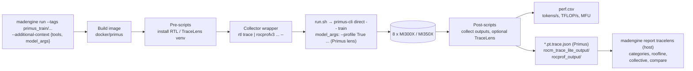

# Blog Proposal: From Operators to Kernels — A Low-Overhead, Layered Profiling Workflow for Primus LLM and Diffusion Training on AMD Instinct MI300X and MI350X

**Status:** Draft proposal for review (rev. 3) · **Author:** Stephen Shao · **Date:** 2026-10-02
**Target venue:** ROCm Blogs (`rocm.blogs.amd.com`, category *Software tools & optimizations*)
**Target length:** ~2,800 words (11–12 min read), 6 tables, 7 figures
**Scope decisions (from review):** single node only; models span backends and workload types; MI300X runs here, MI350X runs done manually later; the workflow uses `madengine run` + `--additional-context` and needn't be fully automated.

### Title options

1. **From Operators to Kernels: A Low-Overhead, Layered Profiling Workflow for Primus Training on AMD Instinct GPUs** *(recommended: says what the reader gets — a workflow, layered, low-overhead)*
2. *One Workflow, Four Lenses: Profiling LLM and Diffusion Training with Primus and madengine on MI300X and MI350X*
3. *See Every Layer: Low-Overhead Profiling of Primus Training with rocprofv3, rocm-trace-lite, and TraceLens via madengine*

---

## 1. Pitch

Training performance problems sit at different layers. A slow step might come from the model graph (an unfused op), the runtime (an exposed all-to-all, a host-side launch gap), or the hardware (a GEMM far from roofline). Each layer has its own profiler, and each profiler has its own install steps, launch wrapper, output format, and overhead. This blog presents a **repeatable, low-overhead profiling workflow** for Primus training on AMD Instinct GPUs. It uses one launcher, `madengine run`, and swaps lenses through `--additional-context`:

| Layer | Lens | Enabled by |
|---|---|---|
| Framework (operators, modules) | **Primus built-in profiler** (PyTorch/Kineto) | Primus flags passed through `model_args` |
| Kernel dispatch (what ran on the GPU, how busy) | **rocm-trace-lite** | `tools: [rocm_trace_lite]` |
| Runtime and communication (HIP API, memcpy, RCCL) | **rocprofv3** | `tools: [rocprofv3_*]` |
| Explanation and comparison (categories, roofline, collectives, diffs) | **TraceLens** | `tools: [tracelens]` in the container, or `madengine report tracelens` on the host |

We apply the workflow to **four Primus models covering four backends and four workload types** (dense LLM pretraining, MoE LLM pretraining, LLM post-training, diffusion pretraining) on **MI300X and MI350X**. We measure what each lens costs against a clean baseline, and show which lens surfaces which insight.

**Positioning:** madengine complements Primus rather than replacing it. Primus's built-in profiler is the right first look at the framework level. madengine adds the lenses below the framework and makes every lens a one-line, reproducible, measured run.

## 2. Audience and takeaways

**Audience:** ML/perf engineers training LLMs or diffusion models with Primus on AMD Instinct GPUs, who know PyTorch but don't profile routinely because setup is costly and overhead is hard to trust.

**Readers should leave with:**
1. A **four-step playbook** (baseline → framework → kernel → runtime, with TraceLens explaining each) and the exact command for each step.
2. An **overhead budget** per lens, measured on MI300X and MI350X, so they know which lens is safe to leave on and which to keep to a short window.
3. A **lens-selection guide**: which question each lens answers, and which it can't.
4. **Four worked examples**, one per workload type, each showing a finding and the lens that found it.

## 3. Model selection

### Criteria (madengine profiling best practices + blog goals)

- **Different backends and workload types**, so the workflow is shown to be general.
- **Exists for both GPU generations**: an `MI300X` config and an `MI355X` config (gfx950; used on MI350X).
- **Single node, 8 GPUs; no dataset preparation** where possible (mock data, or the same data path already validated in this repo).
- **One model tag per profiling run**; never batch several models under a profiler.
- **Validated or low-risk**: prefer configs with existing successful MI300X runs in this repo.

### Table 1 (in blog): Selected models

| # | Workload | Backend | Model / precision | MI300X tag | MI350X tag (gfx950 config) | Why |
|---|---|---|---|---|---|---|
| A | LLM pretraining, dense | **TorchTitan** | Llama 3.1 8B, BF16 | `primus_train/torchtitan_MI300X_llama3.1_8B-BF16-pretrain` | `primus_train/torchtitan_MI355X_llama3.1_8B-BF16-pretrain` | Familiar baseline. GEMM/attention-dominated, so it's the cleanest roofline story. Primus only writes raw traces here and builds no report. MI300X run validated |
| B | LLM pretraining, MoE | **Megatron-LM** | Qwen3-30B-A3B (128 experts, 8 active), FP8 | `primus_train/megatron_MI300X_qwen3_30B_A3B-FP8-pretrain` | `primus_train/megatron_MI355X_qwen3_30B_A3B-FP8-pretrain` | Communication-heavy (expert all-to-all) with FP8 cast kernels. Strongest case for the runtime lens (RCCL). Primus has a full built-in profiler + TraceLens path here, so it's the fair comparison point. MI300X run validated |
| C | LLM post-training (SFT) | **Megatron-Bridge** | Qwen3-32B SFT, BF16 | `primus_train/megatron_bridge_MI300X_qwen3_32b_sft_posttrain` | `primus_train/megatron_bridge_MI355X_qwen3_32b_sft_posttrain` | A different usage pattern: fine-tuning with packed/variable-length sequences. Primus exposes **no profiler knob** for this backend, so the madengine lenses are the main option. MI300X run validated |
| D | Diffusion pretraining (text-to-image) | **Megatron diffusion** (`FluxPretrainTrainer`) | FLUX 535M, BF16, built-in synthetic data | `primus_train/megatron_MI300X_flux_535m_pretrain` | `primus_train/megatron_MI355X_flux_535m_pretrain` | Non-LLM workload: a DiT with very different kernel mix (attention over latent tokens, modulation/elementwise ops). Mock data, so it runs anywhere. Identical config on both GPUs |
| E *(optional)* | Diffusion, **JAX** | MaxDiffusion | WAN 2.1 1.3B | `jax-maxdiffusion/maxdiffusion_MI300X_wan2.1_1.3b-pretrain` | `…_MI355X_…` | Shows that rocm-trace-lite and rocprofv3 work regardless of framework, because they sit below it. Include only if the JAX runs are cheap; TraceLens/XPlane would be manual |

**Recommendation:** A–D as the core; E as a sidebar if time permits.

## 4. Profiling methodology: best practices for low overhead

The workflow is built so the act of measuring changes the measurement as little as possible:

| Practice | How we apply it | Source |
|---|---|---|
| **Separate baseline run** | Every model/GPU gets a run with no tools; **run it twice** to establish run-to-run noise, so overhead claims are above the noise floor | madengine profiling guide, *Best Practices #5* |
| **One profiler per run** | Never stack rocprofv3 and rocm-trace-lite; stack TraceLens (offline analysis) only after a single collector | madengine profiling guide (RTL section) |
| **One model tag per run** | Each command targets exactly one tag | madengine *Best Practices #1* |
| **Short, steady-state capture window** | Profiling runs use `--train_iters 30` instead of the default 3000. The Primus profiler captures steps 10–12 (after warmup) on selected ranks | Primus profiling guide; rocprofv3 docs (trace volume) |
| **Lightest preset that answers the question** | rocprofv3: `rocprofv3_lightweight` (HIP + kernel trace, JSON) by default; `rocprofv3_communication` (adds RCCL/memcpy, pftrace) only for the MoE model. **No counter collection** in the main matrix (multi-pass replay → high overhead); mentioned as follow-up | rocprofv3 how-to; madengine presets |
| **RTL mode matched to the question** | `lite` (~0% claimed) for always-on dispatch timelines. Lite **skips packets that already carry a completion signal (e.g., RCCL kernels)**, so the MoE model also gets a `default`-mode run (madengine preset `rocm_trace_lite_default`; upstream calls this mode `standard`, ~2–4% claimed) when communication kernels must be visible | rocm-trace-lite README; v0.3.3 `rtl trace --help` |
| **Trim framework-profiler cost** | Keep `record_shapes` (needed for TraceLens roofline); set `torch_profiler_with_stack False`; profile a subset of ranks for the operator view, all 8 ranks only for the collective report | Primus profiling guide |
| **Analysis off the critical path** | TraceLens runs on the host with `madengine report tracelens` after the job, so it adds zero runtime cost and can be re-run with different options | madengine profiling guide (*Analyzing on the Host – Recommended*) |
| **Pin and record versions** | Report Primus commit (release/v26.7 `5fb96f8d`), madengine version, ROCm version, RTL wheel (v0.3.3), TraceLens ref, image digest | Reproducibility |

**How overhead is reported:** Δ tokens/s (or samples/s for FLUX) vs. the mean baseline over the full short run, plus the step-time inflation inside the capture window, plus trace size. Lenses whose overhead falls within the baseline noise band are reported as "within noise" rather than as a number.

## 5. Experiment matrix

Per GPU (MI300X now, MI350X later and manually): 4 models × 5 runs, plus 1 extra for the MoE model:

| Run | Purpose | `--additional-context` (abridged) |
|---|---|---|
| B0a, B0b | Baseline ×2 (noise floor) | `{"model_args": "--config_path <yaml> --train_iters 30"}` |
| P1 | Framework lens: Primus profiler (+ TraceLens on host) | `model_args` + `--profile True --use_pytorch_profiler True --profile_step_start 10 --profile_step_end 12 --torch_profiler_with_stack False` (Megatron, FLUX); `--profiling.enable_profiling True` (TorchTitan); Megatron-Bridge: to verify (§9) |
| K2 | Kernel lens: rocm-trace-lite, lite mode | `{"tools": [{"name": "rocm_trace_lite"}], "model_args": ...}` |
| K2s *(model B only)* | Kernel lens incl. RCCL kernels | `{"tools": [{"name": "rocm_trace_lite_default"}], ...}` |
| R3 | Runtime lens: rocprofv3 + TraceLens | `{"tools": [{"name": "rocprofv3_lightweight"}, {"name": "tracelens", "env_vars": {"TRACELENS_MODE": "rocprof"}}], ...}`; model B uses `rocprofv3_communication` |

That is **21 runs per GPU, 42 in total**. Each run is short (30 iterations, with a cached image after the first build).

Example: MoE model, MI300X:

```bash
TAG=primus_train/megatron_MI300X_qwen3_30B_A3B-FP8-pretrain
CFG=examples/megatron/configs/MI300X/qwen3_30B_A3B-FP8-pretrain.yaml
ARGS="--config_path $CFG --train_iters 30"

# B0: baseline
madengine run --tags $TAG --additional-context "{\"model_args\": \"$ARGS\"}"

# P1: Primus built-in profiler (framework lens)
madengine run --tags $TAG --additional-context "{\"model_args\": \"$ARGS --profile True --use_pytorch_profiler True --profile_step_start 10 --profile_step_end 12 --torch_profiler_with_stack False\"}"

# K2: rocm-trace-lite (kernel lens)
madengine run --tags $TAG --additional-context "{\"tools\": [{\"name\": \"rocm_trace_lite\"}], \"model_args\": \"$ARGS\"}"

# R3: rocprofv3 + TraceLens (runtime lens)
madengine run --tags $TAG --additional-context "{\"tools\": [{\"name\": \"rocprofv3_communication\"}, {\"name\": \"tracelens\", \"env_vars\": {\"TRACELENS_MODE\": \"pftrace\"}}], \"model_args\": \"$ARGS\"}"

# Host-side TraceLens on the Primus traces: roofline + multi-rank collective report
madengine report tracelens --gpu-arch MI300X
madengine report tracelens --mode collective --world-size 8
```

**Data and caches:** Primus downloads its own HF weights and converts checkpoints, so the commands above leave data placement to Primus. On a shared node, point it at a large disk: `"docker_mounts": {"/myworkspace/.blog_cache": "/data/<user>/primus_blog_cache"}` with `HF_HOME` and `DATA_PATH` under that path (the run kit does this). Qwen3-32B SFT alone needs ~65 GB of HF weights plus a converted Megatron checkpoint of similar size.

**MI350X (manual):** same commands with the `MI355X` tag/config, and add `"docker_env_vars": {"PRIMUS_GPU_MODEL": "MI355X"}` so Primus loads its gfx950 environment (§9 risk 2). The blog will ship these as ready-made `--additional-context-file` JSON files so readers (and you, on MI350X) can rerun them exactly.

### 5a. MI300X results (rerun 2026-10-03, after profiler validation)

Run with the madengine fix branch; results in `/data/ysha/primus_blog_results/mi300x-r2/` (`summary.csv`). Step time is the median over steps ≥ 5. For P1 it excludes steps 9–13 (capture window ±1), which are reported separately. RTL (K2/K2s) is excluded (risk 6a). Model A is pending a Hugging Face token (gated Llama 3.1 tokenizer).

| Model | Baseline step (noise) | P1 framework lens: outside window / capture steps | R3 rocprofv3: throughput vs baseline | Trace size (P1 / R3) | TraceLens |
|---|---|---|---|---|---|
| B Qwen3-30B-A3B MoE, Megatron | 12.93 s (±0.0%) | 0.995× / 50.1 s (3.9×) | 0.30× (communication preset, 20 iters) | 409 MB / 12 GB pftrace | in-container stopped (disk, ~10 min per rank trace); host-side |
| C Qwen3-32B SFT, Megatron-Bridge | 1.13 s (±3.3%) | within noise / 4.87 s (4.4×) | 0.23× (lightweight, JSON) | 2.1 GB / 19 GB | 17/17 in-container |
| D FLUX 535M, Megatron diffusion | 0.045 s (±7.9%) | within noise / 0.30 s (6.5×) | 0.15× (lightweight, JSON) | 2.4 MB (gz) / 6.4 GB | 17/17 in-container (run rc=3, see risk 4) |

Early takeaways for §6–7: the Primus framework lens is free outside its window but costs 4–7× inside it. rocprofv3 whole-run tracing costs 3–7×, and its trace volume (GBs per 20 steps) makes host-side analysis on a large disk the practical default. Relative cost grows as step time shrinks (launch-bound FLUX pays most).

## 6. Proposed blog outline

The blog is organized **by workflow step**, not by tool, so it reads as a playbook. Tool background is kept short and linked.

| § | Section | ~Words | Visuals |
|---|---|---:|---|
| 1 | **Introduction**: performance problems live at different layers; profiling every layer is costly and trust in overhead is low. What this blog delivers | 250 | — |
| 2 | **The layered profiling model**: framework / kernel / runtime / analysis; which question each answers; what Primus provides natively and where madengine extends it | 350 | Figure 1, Table 2 |
| 3 | **The setup**: madengine + Primus model discovery, how `tools` and `model_args` map to pre-script → wrapper → post-script; hardware/software config; the four models | 350 | Figure 2, Table 1 |
| 4 | **Profiling without perturbing**: the best practices from §4, condensed | 250 | Table 3 |
| 5 | **The playbook**: Step 0 baseline → Step 1 framework (Primus) → Step 2 kernel (RTL) → Step 3 runtime (rocprofv3) → TraceLens throughout. One command per step | 300 | code blocks |
| 6 | **What it costs**: measured overhead and trace size, four models × two GPUs | 250 | Table 4, Figure 3 |
| 7 | **What it finds**: one worked example per model (≈200 words each): A dense roofline (TraceLens on TorchTitan traces); B MoE exposed all-to-all (rocprofv3 RCCL + collective report); C SFT, where profiling is only possible via madengine (kernel mix, idle gaps from variable-length batches); D diffusion kernel mix vs. LLMs (RTL + TraceLens categories) | 800 | Figures 4–7 |
| 8 | **MI300X vs. MI350X through the same lenses**: how the GPU-time breakdown and top kernels shift across generations, observed rather than speculated | 200 | Figure 4 (paired), Table 5 |
| 9 | **Summary and lens-selection cheat sheet** | 150 | Table 6 |
| 10 | **Try it / Additional resources / Disclaimers / System configuration** (ROCm blog standard) | 100 | — |

## 7. Tables planned

**Table 1: Selected models.** See §3.

**Table 2: Which lens answers which question.** Primus built-in vs. madengine additions.

| | Primus built-in profiler | rocm-trace-lite | rocprofv3 | TraceLens |
|---|---|---|---|---|
| Layer | Framework | Kernel dispatch | Runtime + communication (+ HW, not used here) | Analysis (offline) |
| Question answered | Which operator / module? | Which kernels, how busy is each GPU? | Why: launch gaps, memcpy, RCCL overlap? | How efficient, where's the time, what changed? |
| Mechanism | `torch.profiler`, step window, rank selection | HSA interception (`HSA_TOOLS_LIB`) | rocprofiler-sdk | Parses Kineto / rocprofv3 JSON / Perfetto |
| Backends covered | Megatron (+ auto TraceLens), TorchTitan (raw traces), Megatron-Bridge (not exposed) | Any (below framework, incl. JAX) | Any | Any trace it can read |
| Output | `*.pt.trace.json[.gz]` | SQLite `.db`, Perfetto JSON, summary | JSON / pftrace / CSV / rocpd | `.xlsx` + CSV |
| Claimed overhead | Window-limited | ~0% (lite), 2–4% (default/standard) | Depends on preset | Zero (offline) |
| madengine switch | `model_args` | `tools: rocm_trace_lite` | `tools: rocprofv3_*` | `tools: tracelens` / `madengine report tracelens` |

**Table 3: Best-practice checklist.** Condensed from §4.

**Table 4: Overhead and footprint.** Measured.

| Model | GPU | Lens | Throughput | Δ vs baseline (noise ±x%) | Capture-window step-time Δ | Trace size |
|---|---|---|---:|---:|---:|---:|
| A–D | MI300X / MI350X | B0 / P1 / K2 / R3 | *measured* | *measured* | *measured* | *measured* |

**Table 5: MI300X vs. MI350X.** Per model: baseline throughput, GPU-busy %, top-3 kernel categories by share. Measured.

**Table 6: Insight matrix and cheat sheet.** For each model's key finding: which lens(es) surfaced it (✓/✗ across Primus / RTL / rocprofv3 / TraceLens), and the recommended first lens per symptom ("low MFU" → TraceLens roofline; "scales badly" → rocprofv3 RCCL + collective; "always-on monitoring" → RTL lite).

## 8. Figures planned

| Fig | Content | Source |
|---|---|---|
| 1 | **Layered model**: framework / kernel / runtime / analysis, the lens per layer, and the question each answers | Diagram |
| 2 | **Workflow architecture**: `madengine run` → build → pre-scripts → wrapper (`rtl` / `rocprofv3`) → `run.sh` → `primus-cli direct` (+ Primus profiler flags) → 8 ranks → post-scripts → `perf.csv` + traces → TraceLens (draft below) | Diagram |
| 3 | **Overhead chart**: normalized throughput per lens, small multiples for 4 models × 2 GPUs, with the baseline noise band shaded | matplotlib from `perf.csv` |
| 4 | **GPU time breakdown**: stacked bars (compute / exposed comm / exposed memcpy / idle) for each model, MI300X and MI350X side by side | TraceLens `gpu_timeline` |
| 5 | **Kernel-category mix across workloads**: dense LLM vs. MoE vs. SFT vs. diffusion (GEMM, attention, MoE/grouped-GEMM, FP8 cast, elementwise/norm, RCCL) | TraceLens `ops_summary_by_category` / RTL top kernels |
| 6 | **Perfetto, MoE layer**: rocprofv3 RCCL stream vs. compute stream (all-to-all overlap), with the Primus Kineto view of the same step as an inset, showing what the framework view alone misses | `ui.perfetto.dev` |
| 7 | **Roofline scatter**: top GEMM/attention ops of model A on MI300X vs. MI350X | TraceLens roofline (`--gpu-arch`) |

Draft of Figure 2:



## 9. Risks and items to verify before the full run

| # | Risk | Mitigation |
|---|---|---|
| 1 | `model_args` overrides the tag's `args` (so `--config_path` must be repeated). Unverified for each backend's flag syntax (`--profiling.enable_profiling`, `--profile_ranks` lists) | **Resolved (MI300X smoke):** P1 with `model_args` (repeating `--config_path`) produced framework traces on all four backends: TorchTitan (`--profiling.enable_profiling`), Megatron-LM and FLUX (`--profile ... --profile_ranks [0,...,7]`), Megatron-Bridge (`--profiling.*`, see risk 3) |
| 2 | **MI350X env**: `run.sh` maps MI350 → `PRIMUS_GPU_MODEL=MI350X`, but Primus only ships `runner/helpers/envs/MI355X.sh`; it would warn and skip the gfx950 tuning | Set `docker_env_vars.PRIMUS_GPU_MODEL=MI355X` for MI350X runs (or add an MI350 → MI355X mapping in `run.sh`) |
| 3 | Megatron-Bridge (model C) exposes no Primus profiler option | **Resolved (MI300X smoke):** `--profiling.use_pytorch_profiler True --profiling.profile_step_start 10 --profiling.profile_step_end 12 --profiling.profile_ranks [...]` reach the bridge's `ProfilingConfig`. The trace handler writes to `logger.tensorboard_dir`, which defaults to the image's Primus tree and is lost with the container, so also pass `--logger.tensorboard_dir /myworkspace/run_directory/output/tensorboard` (8 rank traces, 2.1 GB uncompressed). Two more requirements: `--lr_warmup_iters 5` (the config's 50 must be below `--train_iters 30`), and `MOUNT_DATA_PATH` so the HF→Megatron conversion persists instead of being redone per run |
| 4 | FLUX trainer (model D) may not go through Megatron's `training.train()`, which Primus's profiler patch hooks | **Resolved (MI300X smoke):** P1 writes Kineto traces for all 8 ranks. Two caveats: (a) `--attention_backend fused` is required on `rocm/primus:v26.7`; (b) FLUX prints `iteration N/M` only in the last rank's log, so `extract_primus_perf.py` (rank-0 log, tokens/s only) exits non-zero and madengine reports the run as failed (rc=3) although training completed. The run kit parses step time from the last rank's log |
| 4b | Data and cache placement. Primus tags declare no madengine `data` entry, so madengine's data provider (`MAD_DATAHOME=/data_dlm_0` in the container) is not used; Primus's prepare hooks download HF weights into `HF_HOME` and write converted checkpoints into `$DATA_PATH/megatron_checkpoints` | The run kit mounts a host cache on the large disk over `/myworkspace/.blog_cache` with `docker_mounts` (default `/data/ysha/primus_blog_cache`; override with `BLOG_CACHE_HOST`). Create the directory first: Docker would otherwise create it owned by root |
| 5 | Trace discovery: TorchTitan writes `rank{N}_trace.json`, which madengine's TraceLens patterns don't match; Primus Megatron traces go to `<exp_root>/tensorboard`, which may sit outside the run directory | Run TraceLens manually on those paths (acceptable, since full automation isn't required) and document the step |
| 6 | RTL modes: madengine's `rocm_trace_lite_default` passes `RTL_MODE=default`; upstream documents `lite/standard/hip/full`. Lite mode hides RCCL kernels | **Resolved:** v0.3.3 rejects `standard` (`rtl trace: error: argument -m/--mode: invalid choice`); its modes are `lite` (skips has-signal packets), `default` (times all count==1 dispatches, skips graph replay) and `full` (needs ROCm 7.13+). K2s uses the `rocm_trace_lite_default` preset. Also seen: lite mode's summary reports a single aggregate "GPU -1" line (41% busy across 8 GPUs for model B) instead of per-GPU utilization |
| 6a | **Blocker: RTL captures no GPU kernels on the `rocm/primus:v26.7` image.** The image ships ROCm 10.0.0 as TheRock pip wheels (`rocm-sdk-core`, torch 2.12, HIP 7.15; no `/opt/rocm`). Model B's K2/K2s "succeeded" with 5.55M ops, but every op is a TransformerEngine roctx `UserMarker` (`nvte_cublas_gemm_v2`, ...), with no kernels, no RCCL and `gpuId=-1`, so the reported "41% GPU utilization" is meaningless. Reproduced outside Primus with a 2-GPU matmul + all-reduce script, for RTL v0.3.3 and v0.3.7: (a) by default HSA routes tools through rocprofiler-register and never dlopens `HSA_TOOLS_LIB`; (b) with `HSA_TOOLS_DISABLE_REGISTER=1` librtl loads ("found 8 GPU agents") but still records 0 ops in `lite` and `standard` | Report upstream to rocm-trace-lite with the probe script. For the blog: drop the kernel lens, run it on an `/opt/rocm` image, or present it as a known limitation (decision needed). Lesson for the playbook: always check a trace's op types, not just that the file exists |
| 6b | rocprofv3 output lost for Primus tags: the `rocprofv3_*` presets pass `-d ./rocprof_output`, but `run.sh` cd's into the Primus root before launching, so traces land in the image's `/workspace/Primus/rocprof_output` and disappear with the container (the first model B R3 run kept only empty dirs) | **Fixed in madengine** (branch `fix/profiling-validation-therock`): `rocprof_wrapper.sh` resolves a relative `-d` against `run_directory`. Same branch: `rocprofv3_perfetto` no longer passes `--perfetto-trace-filename` (rejected by rocprofv3 1.3.5), and the TraceLens pre-script installs `curl`, which Perfetto's `traceconv` needs (every pftrace report failed on the curl-less Primus image). See §9a |
| 7 | RTL `.db` isn't read by TraceLens | Manual `rtl convert trace.db --format rocprofv3` → `TraceLens_generate_perf_report_rocprof` (shown as an optional step) |
| 8 | Stale KPIs in old repo logs (e.g., MFU 126% from an older extractor) | Publish only fresh B0 numbers. **Still present for Megatron-Bridge:** the fresh C P1 run reports 1,602 TFLOP/s/GPU and MFU 122.6%, above MI300X's dense BF16 peak, so `extract_primus_perf.py`'s derived TFLOP/s for the bridge is wrong; its derived tokens/s/GPU (seq × GBS / step time / GPUs) is consistent. Report step time and tokens/s for model C, not TFLOP/s or MFU |
| 9 | TraceLens roofline GPU-arch name for MI350X | Check TraceLens's bundled arch list; otherwise report roofline for MI300X only |
| 10 | External publication | AMD review, system-config footnote, disclaimers; ask Primus maintainers to review Table 2 |

## 9a. Profiler validation on a small model

Before any blog model is profiled, every lens is validated with `docs/blog/runkit/validate_profilers.py`. It runs madengine's `dummy_profiling` fixture (bf16 MLP + DDP all-reduce on 8 GPUs, ~1 min per run) on the same `rocm/primus:v26.7` runtime (ROCm 10.0.0 TheRock wheels) and launches from a cwd outside `run_directory`, as Primus does. It then checks trace **contents**: kernel ops on real GPU ids, RCCL activity, and non-empty TraceLens reports, in-container and host-side. Results land in `blog_results/profiler-validate/run-*/validation.json`.

| Option | Before madengine fixes | After |
|---|---|---|
| torch.profiler (framework lens) + TraceLens pytorch / collective, in-container and host | pass | pass |
| `rocprofv3_lightweight` (+ TraceLens rocprof) | **no trace, run reported SUCCESS** | pass |
| `rocprofv3_communication` (+ TraceLens pftrace) | **no trace, run reported SUCCESS** | pass (RCCL visible) |
| `rocprofv3_perfetto` | **rc=3** (unsupported flag) | pass |
| `rocm_trace_lite`, `rocm_trace_lite_default` | **0 GPU ops, run reported SUCCESS** | fails loudly (rc=3 with diagnosis); needs an upstream RTL fix (risk 6a) |
| Any collector + TraceLens on a run that exits non-zero (Primus FLUX: perf extractor) | **post-scripts skipped: no TraceLens, no trace collection** | post-scripts run best-effort; run stays failed |
| TraceLens post-script on large traces | 600 s cap would fail the run (small model already took ~3 min in pftrace mode) | TraceLens presets allow 7200 s (per-script `timeout`) |

| TraceLens collective report on Megatron-Bridge traces (`<host>_<pid>` names, no rank) | **always skipped** | rank read from Kineto `distributedInfo`; verified on model C's 8 rank traces |

madengine fixes: branch `fix/profiling-validation-therock`, commits `ce01824`, `2ee6480`, `b6d1417` (local, not pushed).

Lesson for the playbook: a profiler run that "succeeds" proves nothing. Check that the trace holds kernels from every GPU, and RCCL where expected.

## 10. Execution plan

0. **Validate every lens on the small model** (§9a), with the madengine fix branch installed. Done on MI300X; rerun on MI350X before its matrix.
1. **MI300X smoke tests** (one B0 + one P1 per model) to clear risks 1, 3, 4, 5.
2. **MI300X full matrix** (21 runs); host-side TraceLens; draft the figures.
3. **Package the run kit** (`--additional-context-file` JSONs plus a short run sheet) for the manual MI350X runs, including the `PRIMUS_GPU_MODEL=MI355X` override.
4. **MI350X matrix** (run manually by you); merge results into Tables 4–5 and Figures 3–4.
5. **Write the full draft** (~2,800 words) following §6; review with the Primus and madengine owners; submit.

## 11. Remaining questions for the reviewer

1. Is A–D the right model set? Should E (JAX MaxDiffusion) go in as a sidebar?
2. Title: go with option 1?
3. For the MI350X runs, should the blog say "MI350X" while using the MI355X-tagged configs (same gfx950 architecture), with a footnote explaining this?

## References

- Primus profiling guide: `scripts/Primus/docs/04-technical-guides/profiling-and-observability.md`; profiler patch `primus/backends/megatron/patches/torch_profiler_patches.py`; TraceLens integration `primus/backends/megatron/training/mlflow_artifacts.py`
- rocm-trace-lite: https://github.com/sunway513/rocm-trace-lite
- TraceLens blog: https://rocm.blogs.amd.com/software-tools-optimization/tracelens/README.html
- rocprofv3 how-to: https://rocm.docs.amd.com/projects/rocprofiler-sdk/en/latest/how-to/using-rocprofv3.html
- madengine profiling guide: `madengine/docs/profiling.md`; presets `madengine/examples/profiling-configs/`; TraceLens discovery `src/madengine/scripts/common/tools/tracelens_analyze.py`
- Primus model discovery: `scripts/primus_train/get_models_json.py`; launcher `scripts/primus_train/run.sh`
